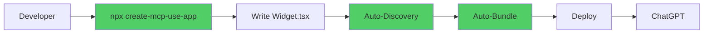
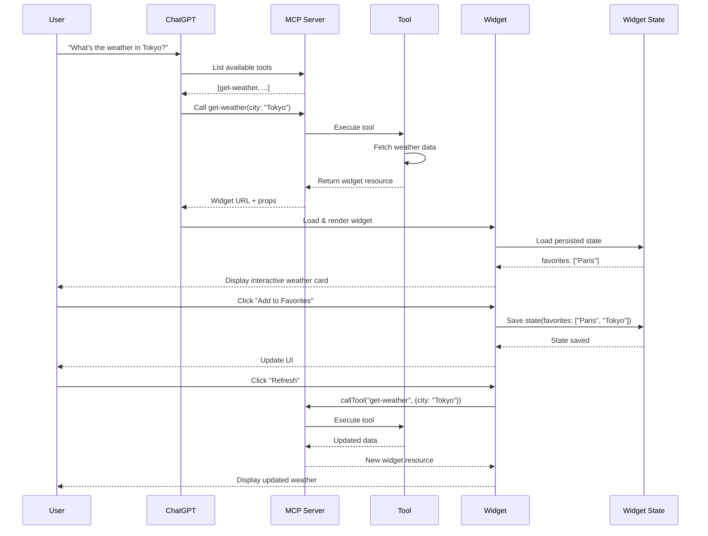
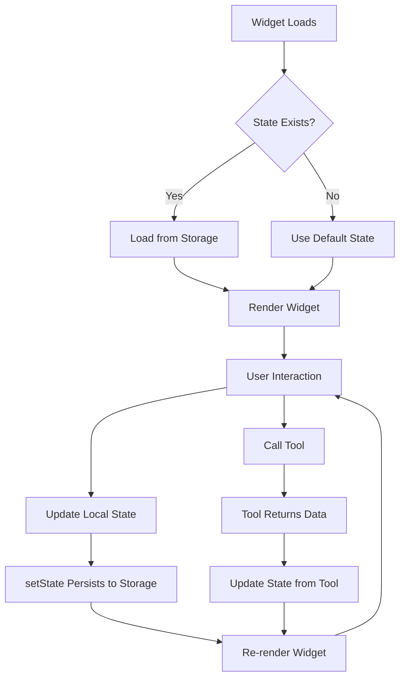

# Building ChatGPT Apps with Widgets

## Introduction

ChatGPT Apps enable developers to build rich, interactive user interfaces that go beyond simple text responses. Using the **OpenAI Apps SDK**, you can create widgets that display dynamic content, handle user interactions, maintain state, and call tools—all within the ChatGPT interface.

Widgets transform static responses into interactive experiences:
- Display data in tables, carousels, or custom layouts
- Allow users to filter, sort, or manipulate results
- Persist state across conversations
- Call MCP tools directly from the UI

However, building widgets with the official OpenAI Apps SDK involves significant manual setup: configuring build tools, managing React mounting, implementing custom state hooks, and handling Content Security Policy (CSP) configurations.

**mcp-use simplifies this entire process** by providing zero-config widget development, automatic bundling, built-in hooks, and seamless integration with MCP servers—letting you focus on building great experiences instead of wrestling with configuration.

## The Official OpenAI Apps SDK Approach

The official OpenAI Apps SDK requires developers to manually set up and configure multiple aspects of widget development.

### Manual Setup Requirements

When building widgets with the official SDK, you need to:

1. **Separate Project Structure**: Organize your project into distinct `server/` and `web/` directories
2. **Manual Bundling**: Configure esbuild or webpack to bundle your React components
3. **Manual React Setup**: Write mounting code to attach components to the DOM
4. **Custom State Hooks**: Implement your own `useWidgetState` hook for state persistence
5. **Manual CSP Configuration**: Configure Content Security Policy for your widget domains
6. **Manual Asset Handling**: Set up static asset serving and path management
7. **Manual Tool Registration**: Explicitly register tools and wire up widget responses

### Traditional Development Flow

```mermaid
flowchart LR
    Developer[Developer] --> Setup[Manual Setup]
    Setup --> Structure[Create server/ & web/]
    Structure --> Config[Configure Build Tools]
    Config --> Hooks[Implement Custom Hooks]
    Hooks --> Bundle[Manual Bundling]
    Bundle --> CSP[Configure CSP]
    CSP --> Deploy[Deploy]
    Deploy --> ChatGPT[ChatGPT]
    
    style Setup fill:#ff6b6b
    style Config fill:#ff6b6b
    style Hooks fill:#ff6b6b
    style Bundle fill:#ff6b6b
    style CSP fill:#ff6b6b
```



### Code Example: Official SDK Setup

**Project Structure:**

```
app/
├── server/                 # Python or Node MCP server
│   ├── main.py
│   └── requirements.txt
└── web/                    # React widget bundle
    ├── package.json
    ├── tsconfig.json
    ├── esbuild.config.js   # Manual bundler config
    ├── src/
    │   ├── component.tsx
    │   └── hooks.ts
    └── dist/
        └── component.js     # Build output
```

**Manual Build Configuration (esbuild.config.js):**

```javascript
const esbuild = require('esbuild');

esbuild.build({
  entryPoints: ['src/component.tsx'],
  bundle: true,
  outfile: 'dist/component.js',
  format: 'iife',
  platform: 'browser',
  target: 'es2020',
  jsx: 'automatic',
  external: ['react', 'react-dom'],
  minify: true,
}).catch(() => process.exit(1));
```

**Custom State Hook Implementation:**

```typescript
// hooks.ts - Must implement this yourself
import { useState, useEffect, useCallback } from 'react';

type SetStateAction<T> = T | ((prev: T) => T);

export function useWidgetState<T>(
  defaultState: T | (() => T)
): readonly [T, (state: SetStateAction<T>) => void] {
  // Read initial state from window.openai
  const widgetStateFromWindow = (window as any).openai?.widgetState as T;

  const [widgetState, _setWidgetState] = useState<T>(() => {
    if (widgetStateFromWindow != null) {
      return widgetStateFromWindow;
    }
    return typeof defaultState === 'function' 
      ? (defaultState as () => T)() 
      : defaultState;
  });

  // Sync with window state changes
  useEffect(() => {
    if (widgetStateFromWindow != null) {
      _setWidgetState(widgetStateFromWindow);
    }
  }, [widgetStateFromWindow]);

  // Persist state back to ChatGPT
  const setWidgetState = useCallback(
    (state: SetStateAction<T>) => {
      _setWidgetState((prevState) => {
        const newState = typeof state === 'function' 
          ? (state as (prev: T) => T)(prevState) 
          : state;
        
        if ((window as any).openai?.setWidgetState) {
          (window as any).openai.setWidgetState(newState);
        }
        return newState;
      });
    },
    []
  );

  return [widgetState, setWidgetState] as const;
}
```

**Manual Component Mounting:**

```typescript
// component.tsx
import React from 'react';
import ReactDOM from 'react-dom/client';
import { useWidgetState } from './hooks';

interface ToolOutput {
  city: string;
  temperature: number;
  conditions: string;
}

function WeatherWidget() {
  // Read initial tool output from window
  const toolOutput = (window as any).openai?.toolOutput as ToolOutput;
  const [favorites, setFavorites] = useWidgetState<string[]>([]);

  const handleAddFavorite = () => {
    setFavorites(prev => [...prev, toolOutput.city]);
  };

  const handleCallTool = async () => {
    const result = await (window as any).openai.callTool(
      'refresh_weather',
      { city: toolOutput.city }
    );
    console.log(result);
  };

  return (
    <div>
      <h2>Weather in {toolOutput.city}</h2>
      <p>{toolOutput.temperature}°C - {toolOutput.conditions}</p>
      <button onClick={handleAddFavorite}>Add to Favorites</button>
      <button onClick={handleCallTool}>Refresh</button>
    </div>
  );
}

// Manual mounting code
const root = document.getElementById('root');
if (root) {
  ReactDOM.createRoot(root).render(<WeatherWidget />);
}
```

**Manual Tool Response:**

```python
# server/main.py
from mcp.server import Server
import json

server = Server("weather-app")

@server.tool()
async def get_weather(city: str):
    # Fetch weather data
    weather_data = await fetch_weather_api(city)
    
    # Manually construct widget response
    return {
        "content": [
            {
                "type": "resource",
                "resource": {
                    "uri": "https://yourserver.com/widgets/weather.js",
                    "mimeType": "text/html",
                    "text": json.dumps({
                        "city": city,
                        "temperature": weather_data.temp,
                        "conditions": weather_data.conditions
                    })
                }
            }
        ]
    }
```

As you can see, the official approach requires significant boilerplate and manual configuration at every step.

## The mcp-use Simplified Approach

mcp-use eliminates all the manual setup and provides a zero-config development experience for building ChatGPT widgets.

### Zero-Config Features

With mcp-use, you get:

1. **Single Command Setup**: `npx create-mcp-use-app my-app --template apps-sdk`
2. **Automatic Widget Discovery**: Drop `.tsx` files in `resources/` folder—they're automatically registered
3. **Built-in Bundling**: Hot reload and production builds work out of the box
4. **Pre-built React Hooks**: Use `useWidget()` for props, state, tool calls, and display modes
5. **Automatic CSP Configuration**: Content Security Policy is configured automatically
6. **Automatic Tool Registration**: Widgets become tools automatically based on metadata
7. **Automatic Asset Handling**: `public/` folder serves static assets automatically

### Simplified Development Flow



### Code Example: mcp-use Setup

**Project Structure:**

```
my-app/
├── resources/              # 👈 Just drop widgets here
│   └── weather-display.tsx
├── public/                 # 👈 Static assets auto-served
│   └── icons/
│       └── weather.svg
├── index.ts               # MCP server entry
└── package.json
```

**Simple Widget File:**

```tsx
// resources/weather-display.tsx
import { McpUseProvider, useWidget, type WidgetMetadata } from 'mcp-use/react';
import { z } from 'zod';

// Define widget metadata - auto-generates tool!
export const widgetMetadata: WidgetMetadata = {
  description: 'Display weather information for a city',
  inputs: z.object({
    city: z.string(),
    temperature: z.number(),
    conditions: z.string(),
    humidity: z.number(),
    windSpeed: z.number(),
  }),
};

// Your widget component
const WeatherDisplay: React.FC = () => {
  // Everything you need in one hook!
  const { props, state, setState, callTool } = useWidget();

  const handleAddFavorite = async () => {
    await setState({
      favorites: [...(state?.favorites || []), props.city]
    });
  };

  const handleRefresh = async () => {
    const result = await callTool('get_weather', { city: props.city });
    console.log('Refreshed:', result);
  };

  return (
    <McpUseProvider autoSize>
      <div className="weather-card">
        <h2>Weather in {props.city}</h2>
        <div className="temperature">{props.temperature}°C</div>
        <p>{props.conditions}</p>
        <div className="details">
          <span>Humidity: {props.humidity}%</span>
          <span>Wind: {props.windSpeed} km/h</span>
        </div>
        <button onClick={handleAddFavorite}>Add to Favorites</button>
        <button onClick={handleRefresh}>Refresh</button>
      </div>
    </McpUseProvider>
  );
};

export default WeatherDisplay;
```

**Simple Tool with Widget Response:**

```typescript
// index.ts
import { MCPServer, widget, text } from 'mcp-use/server';
import { z } from 'zod';

const server = new MCPServer({
  name: 'weather-app',
  version: '1.0.0',
});

// Tool automatically returns widget
server.tool({
  name: 'get-weather',
  description: 'Get current weather for a city',
  schema: z.object({
    city: z.string().describe('City name')
  }),
  widget: {
    name: 'weather-display',  // Matches resources/weather-display.tsx
    invoking: 'Fetching weather...',
    invoked: 'Weather loaded'
  }
}, async ({ city }) => {
  const weatherData = await fetchWeatherAPI(city);
  
  // Simple helper returns both text and widget
  return widget({
    props: {
      city,
      temperature: weatherData.temp,
      conditions: weatherData.conditions,
      humidity: weatherData.humidity,
      windSpeed: weatherData.windSpeed
    },
    output: text(`Weather in ${city}: ${weatherData.temp}°C`)
  });
});

server.start();
```

That's it! No build configuration, no custom hooks, no manual mounting—just write your widget and mcp-use handles the rest.

## Widget Interaction Flow

Understanding the complete lifecycle of a widget interaction helps you build more effective ChatGPT Apps.

### Complete Lifecycle



### Key Interaction Patterns

#### 1. Tool Invocation → Widget Rendering

When a user asks a question, ChatGPT:
1. Identifies the appropriate tool based on the query
2. Calls the MCP server's tool with parameters
3. Receives a widget resource in the response
4. Loads and renders the widget in the UI

#### 2. Widget State Persistence

Widgets can maintain state across interactions:
- State is saved to ChatGPT's localStorage
- Survives page reloads and conversation history
- Accessible via `useWidget()` hook
- Updates trigger UI re-renders

#### 3. Widget-to-Tool Communication

Widgets can call tools directly:
- User interacts with widget controls
- Widget invokes `callTool()` to execute MCP server tools
- Server processes the request and returns results
- Widget updates based on the response

### State Flow Diagram



## Testing with the MCP Inspector

The MCP Inspector is your primary tool for developing and debugging widgets. It provides a complete testing environment that mirrors ChatGPT's behavior.

### Inspector Features for Widget Development

1. **Live Widget Preview**: See your widgets render in real-time as you develop
2. **Tool Execution**: Test tool calls and view widget responses
3. **State Inspection**: Monitor widget state changes
4. **RPC Logging**: Debug MCP protocol messages
5. **Hot Reload**: Changes reflect immediately without restart

### Using the Inspector

**Start your server with Inspector:**

```bash
npm run dev
# Opens http://localhost:3000/inspector
```

**Connect to your server:**


The Inspector connects to your local MCP server, allowing you to test widgets before deploying to ChatGPT.

**Execute tools that return widgets:**


When you call a tool that returns a widget, the Inspector renders it just like ChatGPT would.

**Debug widget interactions:**


View detailed RPC logs to understand the communication between your widget and the MCP server.

**Monitor server status:**


The Inspector shows connection status, available tools, resources, and prompts.

### Testing Workflow

1. **Start development**: Run `npm run dev` to start server with hot reload
2. **Open Inspector**: Navigate to `http://localhost:3000/inspector`
3. **Connect to server**: Use the connection form to connect to your local server
4. **Test tool calls**: Execute tools from the Inspector chat interface
5. **Verify widgets**: Confirm widgets render correctly with proper styling
6. **Test interactions**: Click buttons, update state, call tools from widgets
7. **Debug issues**: Use RPC logs and console to identify problems
8. **Iterate**: Make changes and see them reflected immediately

For complete Inspector documentation, see [Debugging ChatGPT Apps](/inspector/debugging-chatgpt-apps).

## OpenAI SDK vs mcp-use: Feature Comparison

| Aspect | OpenAI Apps SDK | mcp-use |
|--------|-----------------|---------|
| **Setup** | Manual project structure with separate `server/` and `web/` directories | Single command: `npx create-mcp-use-app` |
| **Bundling** | Manual esbuild/webpack configuration required | Automatic bundling with hot reload built-in |
| **Widget Discovery** | Manual registration of widget URLs | Auto-discovery from `resources/` folder |
| **State Management** | Custom `useWidgetState` hook implementation | Built-in `useWidget()` hook with state included |
| **Tool Registration** | Manual tool-to-widget wiring | Automatic based on widget metadata |
| **CSP Configuration** | Manual Content Security Policy setup | Automatic CSP with trusted domains |
| **Hot Reload** | Manual setup with watch mode | Built-in development server with HMR |
| **Asset Handling** | Manual static file serving configuration | Automatic `public/` folder serving |
| **React Setup** | Manual ReactDOM mounting code | Automatic mounting via `McpUseProvider` |
| **TypeScript** | Manual tsconfig and type definitions | Pre-configured with full type safety |
| **Inspector Integration** | No built-in debugging tools | Built-in Inspector for testing |
| **Development Server** | Need to set up separately | Integrated at `http://localhost:3000` |
| **Widget Props** | Manual `window.openai.toolOutput` parsing | Type-safe `props` from `useWidget()` |
| **Tool Calls from Widget** | Manual `window.openai.callTool()` | Simple `callTool()` from `useWidget()` |
| **Display Mode Control** | Manual `window.openai.requestDisplayMode()` | Built-in `requestDisplayMode()` from hook |
| **Error Handling** | Manual error boundary implementation | Built-in `ErrorBoundary` component |
| **Theme Support** | Manual theme management | Built-in `ThemeProvider` with system theme |

## Code Comparison: Common Tasks

### Example 1: Widget Setup

<Tabs>
  <Tab title="OpenAI Apps SDK">

```typescript
// Requires: package.json, tsconfig.json, esbuild.config.js
// Directory structure: server/, web/src/, web/dist/

// web/src/weather.tsx
import React from 'react';
import ReactDOM from 'react-dom/client';

interface WeatherData {
  city: string;
  temperature: number;
  conditions: string;
}

function WeatherWidget() {
  // Manual access to tool output
  const data = (window as any).openai?.toolOutput as WeatherData;
  
  if (!data) {
    return <div>Loading...</div>;
  }

  return (
    <div>
      <h2>{data.city}</h2>
      <p>{data.temperature}°C</p>
      <p>{data.conditions}</p>
    </div>
  );
}

// Manual mounting
const root = document.getElementById('root');
if (root) {
  ReactDOM.createRoot(root).render(
    <React.StrictMode>
      <WeatherWidget />
    </React.StrictMode>
  );
}
```

Build command: `esbuild src/weather.tsx --bundle --outfile=dist/weather.js`

  </Tab>
  <Tab title="mcp-use">

```tsx
// resources/weather.tsx - that's it, one file!
import { McpUseProvider, useWidget, type WidgetMetadata } from 'mcp-use/react';
import { z } from 'zod';

export const widgetMetadata: WidgetMetadata = {
  description: 'Display weather information',
  inputs: z.object({
    city: z.string(),
    temperature: z.number(),
    conditions: z.string(),
  }),
};

const WeatherWidget: React.FC = () => {
  const { props } = useWidget();

  return (
    <McpUseProvider autoSize>
      <div>
        <h2>{props.city}</h2>
        <p>{props.temperature}°C</p>
        <p>{props.conditions}</p>
      </div>
    </McpUseProvider>
  );
};

export default WeatherWidget;
```

No build configuration needed—auto-bundled on `npm run dev`!

  </Tab>
</Tabs>

### Example 2: State Management

<Tabs>
  <Tab title="OpenAI Apps SDK">

```typescript
// Must implement custom hook
import { useState, useEffect, useCallback } from 'react';

type SetStateAction<T> = T | ((prev: T) => T);

function useWidgetState<T>(defaultState: T) {
  const widgetStateFromWindow = (window as any).openai?.widgetState as T;

  const [widgetState, _setWidgetState] = useState<T>(() => {
    if (widgetStateFromWindow != null) {
      return widgetStateFromWindow;
    }
    return defaultState;
  });

  useEffect(() => {
    if (widgetStateFromWindow != null) {
      _setWidgetState(widgetStateFromWindow);
    }
  }, [widgetStateFromWindow]);

  const setWidgetState = useCallback((state: SetStateAction<T>) => {
    _setWidgetState((prevState) => {
      const newState = typeof state === 'function' 
        ? (state as (prev: T) => T)(prevState) 
        : state;
      
      if ((window as any).openai?.setWidgetState) {
        (window as any).openai.setWidgetState(newState);
      }
      return newState;
    });
  }, []);

  return [widgetState, setWidgetState] as const;
}

// Using the hook
function MyWidget() {
  const [favorites, setFavorites] = useWidgetState<string[]>([]);
  
  const addFavorite = (city: string) => {
    setFavorites(prev => [...prev, city]);
  };

  return <div>{/* ... */}</div>;
}
```

  </Tab>
  <Tab title="mcp-use">

```tsx
import { useWidget } from 'mcp-use/react';

function MyWidget() {
  // State management built-in!
  const { state, setState } = useWidget();
  
  const addFavorite = async (city: string) => {
    await setState({
      favorites: [...(state?.favorites || []), city]
    });
  };

  return <div>{/* ... */}</div>;
}
```

  </Tab>
</Tabs>

### Example 3: Tool Invocation from Widget

<Tabs>
  <Tab title="OpenAI Apps SDK">

```typescript
function MyWidget() {
  const handleRefresh = async () => {
    try {
      // Manual access to window.openai
      const result = await (window as any).openai.callTool(
        'refresh_data',
        { id: '123' }
      );
      
      if (result.isError) {
        console.error('Tool call failed:', result);
      } else {
        console.log('Success:', result.content);
      }
    } catch (error) {
      console.error('Error calling tool:', error);
    }
  };

  return <button onClick={handleRefresh}>Refresh</button>;
}
```

  </Tab>
  <Tab title="mcp-use">

```tsx
import { useWidget } from 'mcp-use/react';

function MyWidget() {
  const { callTool } = useWidget();
  
  const handleRefresh = async () => {
    try {
      const result = await callTool('refresh_data', { id: '123' });
      console.log('Success:', result.content);
    } catch (error) {
      console.error('Error:', error);
    }
  };

  return <button onClick={handleRefresh}>Refresh</button>;
}
```

  </Tab>
</Tabs>

### Example 4: Display Mode Control

<Tabs>
  <Tab title="OpenAI Apps SDK">

```typescript
function MyWidget() {
  const [currentMode, setCurrentMode] = useState('inline');

  const goFullscreen = async () => {
    try {
      const result = await (window as any).openai.requestDisplayMode('fullscreen');
      setCurrentMode(result.mode);
    } catch (error) {
      console.error('Failed to change display mode:', error);
    }
  };

  return (
    <div>
      <p>Current mode: {currentMode}</p>
      <button onClick={goFullscreen}>Go Fullscreen</button>
    </div>
  );
}
```

  </Tab>
  <Tab title="mcp-use">

```tsx
import { useWidget } from 'mcp-use/react';

function MyWidget() {
  const { displayMode, requestDisplayMode } = useWidget();

  const goFullscreen = async () => {
    await requestDisplayMode('fullscreen');
  };

  return (
    <div>
      <p>Current mode: {displayMode}</p>
      <button onClick={goFullscreen}>Go Fullscreen</button>
    </div>
  );
}
```

  </Tab>
</Tabs>

## Next Steps

Now that you understand how ChatGPT Apps work and how mcp-use simplifies widget development, explore these resources:

<CardGroup cols={2}>
  <Card title="UI Widgets Guide" icon="paintbrush" href="/typescript/server/ui-widgets">
    Complete guide to building widgets with mcp-use, including advanced patterns and best practices
  </Card>
  <Card title="Creating Apps SDK Server" icon="server" href="/typescript/server/creating-apps-sdk-server">
    Step-by-step tutorial for setting up an MCP server with Apps SDK widgets
  </Card>
  <Card title="Inspector Debugging" icon="bug" href="/inspector/debugging-chatgpt-apps">
    Learn to debug and test your widgets using the MCP Inspector
  </Card>
  <Card title="Widget Components" icon="puzzle-piece" href="/typescript/server/widget-components/mcpuseprovider">
    Reference documentation for all widget components and hooks
  </Card>
</CardGroup>

### Related Documentation

- [MCP 101](/home/mcp101) - Understanding MCP fundamentals
- [Response Helpers](/typescript/server/response-helpers) - Helper functions for tool responses
- [Widget Components Reference](/typescript/server/widget-components/usewidget) - Complete API documentation
- [Examples](/typescript/server/examples) - Browse example projects and templates

### Ready to Build?

Create your first ChatGPT App with widgets:

```bash
npx create-mcp-use-app my-chatgpt-app --template apps-sdk
cd my-chatgpt-app
npm run dev
```

Open `http://localhost:3000/inspector` and start building interactive ChatGPT experiences!
