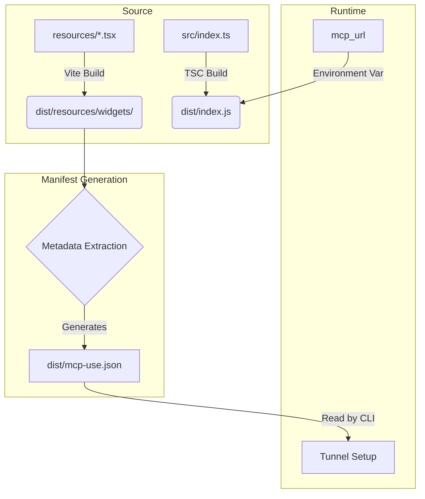

This guide covers how to set up a development environment for the MCP Inspector and contribute to the project.

## Development Setup

### Prerequisites

- **Node.js**: Version 18 or higher
- **Package Manager**: npm, yarn, or pnpm
- **Git**: For cloning the repository

### Cloning the Repository

```bash
git clone https://github.com/mcp-use/mcp-use.git
cd mcp-use/libraries/typescript/packages/inspector
```

### Installing Dependencies

```bash
pnpm install
```

### Development Scripts

The inspector uses several development scripts:

#### `dev`

Run both client and server in development mode concurrently:

```bash
pnpm dev
```

This starts:
- **Vite dev server** on port 3000 (client)
- **API server** on port 3001 (server)


### Building the Project

Build both client and server:

```bash
pnpm build
```

This runs:
- `build:client` - Builds React app with Vite
- `build:server` - Builds TypeScript server code
- `build:cli` - Builds CLI executable

**Output:**
- Client: `dist/client/`
- Server: `dist/server/`
- CLI: `dist/cli.js`


## Project Structure

### Client Code

**Location:** `src/client/`

**Key directories:**
- `components/` - React components
- `context/` - React context providers
- `hooks/` - Custom React hooks
- `utils/` - Utility functions
- `telemetry/` - Analytics and telemetry

**Entry point:** `src/client/main.tsx`

### Server Code

**Location:** `src/server/`

**Key files:**
- `server.ts` - Main server setup
- `cli.ts` - CLI implementation
- `middleware.ts` - Express/Hono integration
- `shared-routes.ts` - API routes
- `shared-static.ts` - Static file serving

### Build Outputs

**Location:** `dist/`

**Structure:**
- `client/` - Built React app
- `server/` - Compiled server code
- `cli.js` - CLI executable

### Configuration Files

- `package.json` - Dependencies and scripts
- `tsconfig.json` - TypeScript configuration
- `tsconfig.server.json` - Server-specific TS config
- `vite.config.ts` - Vite configuration
- `eslint.config.js` - ESLint configuration

## Architecture & Build Strategy

Understanding how `mcp-use` projects are built and run is crucial for contributing to the CLI and core packages. The ecosystem relies on `@mcp-use/cli` to orchestrate the build process, acting as both a build tool (wrapping Vite and TSC) and a runtime manager.

### The Build Pipeline

The build process splits a user's project into two distinct pipelines, both outputting to the `dist/` directory:

1.  **UI Pipeline**: Compiles React components in `resources/` into standalone static web apps (HTML/JS/CSS) using Vite.
2.  **Server Pipeline**: Compiles TypeScript server code in `src/` using `tsc`.



### The Manifest (`mcp-use.json`)

The `dist/mcp-use.json` file is the registry of a deployed application, automatically generated by `mcp-use build` or `mcp-use start`. It serves as the source of truth for:

*   **Widget Registry**: Lists all available UI components and their input schemas.
*   **Tunnel State**: Persists the tunnel subdomain (e.g., `happy-cat`) to maintain a consistent URL across restarts.
*   **Build Metadata**: Contains timestamps and inspector configuration.

**Example Manifest:**

```json
{
  "tunnel": {
    "subdomain": "happy-cat"
  },
  "widgets": {
    "weather-card": {
      "title": "Weather Card",
      "description": "Displays weather for a location",
      "inputs": {
        "city": { "type": "string" }
      }
    }
  },
  "includeInspector": true,
  "buildTime": "2024-05-20T10:00:00.000Z"
}
```

### Tunneling & `mcp_url`

The `mcp_url` is the public-facing URL of the MCP server (e.g., `https://happy-cat.mcp-use.run`), essential for making the local server accessible to external clients like Claude Desktop.

*   **Setup**: `mcp-use start --tunnel` initiates the tunnel and assigns a subdomain.
*   **Runtime**: The CLI sets the `MCP_URL` environment variable for the server process.
*   **Usage**: The server uses `MCP_URL` to construct fully qualified links to its UI resources (widgets).

```typescript
// Internal logic example
const baseUrl = process.env.MCP_URL || `http://localhost:${port}`;
const widgetUrl = `${baseUrl}/mcp-use/widgets/weather-card`;
```

### Contributor Project Structure

When contributing to the ecosystem or building tools that interface with it, expect the following structure in `mcp-use` projects:

```text
my-mcp-project/
├── package.json         # Must include @mcp-use/cli
├── tsconfig.json        # Standard TypeScript config
├── resources/           # UI Widgets (React components)
│   ├── weather.tsx      # Becomes dist/resources/widgets/weather/
│   └── styles.css       # Optional global styles
└── src/
    └── index.ts         # Server entry point
```

## Contributing

### GitHub Workflow

1. **Fork the repository**
2. **Create a branch**: `git checkout -b feature/your-feature`
3. **Make changes**
4. **Commit**: `git commit -m "Add feature"`
5. **Push**: `git push origin feature/your-feature`
6. **Open Pull Request**

### Creating Issues

Before creating an issue:

1. **Search existing issues** to avoid duplicates
2. **Check documentation** for solutions
3. **Gather information**:
   - Error messages
   - Steps to reproduce
   - Expected vs actual behavior
   - Environment details

**Issue templates:**
- Bug reports
- Feature requests
- Documentation improvements

### Pull Request Process

**Before submitting:**

1. **Update tests** if applicable
2. **Run linting**: `npm run lint:fix`
3. **Type check**: `npm run type-check`
4. **Build**: `npm run build`
5. **Test manually** in development

**PR requirements:**
- Clear description of changes
- Reference related issues
- Screenshots for UI changes
- Update documentation if needed

### Code Style

**ESLint Configuration:**
- Follows project ESLint rules
- Auto-fixable with `npm run lint:fix`
- Enforced in CI/CD

**TypeScript:**
- Strict mode enabled
- No `any` types (use proper types)
- Proper error handling

**React:**
- Functional components
- Hooks for state management
- Proper prop types

### Testing Guidelines

**Manual Testing:**
- Test in development mode
- Test in production build
- Test different browsers
- Test different connection types

**Test Scenarios:**
- Connection establishment
- Tool execution
- Widget rendering
- Error handling
- Authentication flows

### Commit Message Conventions

Follow conventional commits:

```
feat: add saved requests feature
fix: resolve connection timeout issue
docs: update CLI documentation
refactor: simplify connection logic
test: add widget rendering tests
```

**Types:**
- `feat`: New feature
- `fix`: Bug fix
- `docs`: Documentation
- `refactor`: Code refactoring
- `test`: Tests
- `chore`: Maintenance

## Development Tips

### Hot Reload

**Client (Vite):**
- Changes to React components reload instantly
- State preserved when possible
- Fast refresh for React components

**MCP Server (HMR):**
- Tools, prompts, and resources update without restart
- Connected clients stay connected
- Inspector auto-refreshes when `list_changed` notifications are received
- No need to reconnect after code changes

**Server (tsx watch fallback):**
- TypeScript files auto-recompile
- Server restarts on changes
- Use `--no-hmr` flag if HMR causes issues

### Debugging Techniques

**Browser DevTools:**
- React DevTools for component inspection
- Network tab for API calls
- Console for logs and errors

**Server Debugging:**
- Console logs in terminal
- TypeScript source maps
- Node.js debugger support

**VS Code:**
- Attach debugger to Node process
- Breakpoints in TypeScript
- Watch expressions

### Common Issues and Solutions

**Port Conflicts:**

**Issue:** Port 3000 or 3001 already in use

**Solution:**
```bash
# Find process using port
lsof -ti:3000 | xargs kill

# Or use different ports
PORT=3002 npm run dev:server
```

**Build Errors:**

**Issue:** TypeScript compilation errors

**Solution:**
- Run `npm run type-check` to see all errors
- Fix type errors
- Ensure all imports are correct

**Client Not Loading:**

**Issue:** Blank page or 404 errors

**Solution:**
- Check Vite dev server is running
- Verify port 3000 is accessible
- Check browser console for errors
- Clear browser cache

**Dependency Issues:**

**Issue:** Module not found errors

**Solution:**
```bash
# Clean install
rm -rf node_modules package-lock.json
npm install

# Or with yarn
rm -rf node_modules yarn.lock
yarn install
```

### Port Conflicts Resolution

**Development ports:**
- **3000**: Vite dev server (client)
- **3001**: API server (server)

**If ports are in use:**
1. Stop other services using these ports
2. Or modify port in configuration
3. Update any hardcoded port references

**Check port usage:**
```bash
# macOS/Linux
lsof -i :3000
lsof -i :3001

# Windows
netstat -ano | findstr :3000
netstat -ano | findstr :3001
```

## Getting Help

### Resources

- **GitHub Issues**: [Report bugs and request features](https://github.com/mcp-use/mcp-use/issues)
- **Discord**: [Join the community](https://discord.gg/XkNkSkMz3V)
- **Documentation**: [Full documentation](/inspector/index)

### Code of Conduct

Please read and follow our [Code of Conduct](https://github.com/mcp-use/mcp-use/blob/main/CODE_OF_CONDUCT.md) when contributing.

## Related Documentation

- [Getting Started](/inspector/index) - Inspector overview
- [Integration](/inspector/integration) - Mounting inspector in apps
- [Self-Hosting](/inspector/self-hosting) - Production deployment

