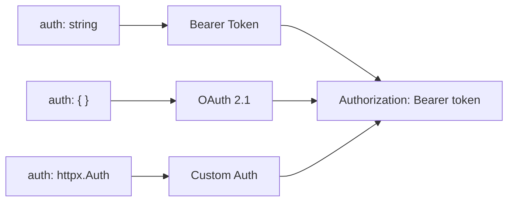

## Overview

MCP servers can require authentication to protect resources and control access. `mcp-use` handles authentication automatically based on your configuration.



## Choose Your Method

<CardGroup cols={1}>
  <Card title="Bearer Token" icon="ticket" href="/python/client/authentication/bearer">
    **Simplest option**

    Use a static API key or token. Best for services that issue long-lived credentials.

    ```python
    "auth": "sk-your-api-key"
    ```
  </Card>
  <Card title="OAuth 2.1" icon="shield-check" href="/python/client/authentication/oauth">
    **MCP standard**

    Full OAuth flow with automatic discovery, PKCE, and token refresh. Required by many MCP servers.

    ```python
    "auth": { "scope": "read write" }
    ```
  </Card>
  <Card title="Custom Auth" icon="wrench" href="/python/client/authentication/custom">
    **Full control**

    Use any `httpx.Auth` object for Basic, Digest, or custom authentication schemes.

    ```python
    "auth": BasicAuth("user", "pass")
    ```
  </Card>
</CardGroup>

## Quick Start Examples

<Tabs>
  <Tab title="OAuth (Auto)">
    For servers with OAuth support, just provide the URL:

    ```python
    from mcp_use import MCPClient

    config = {
        "mcpServers": {
            "linear": {
                "url": "https://mcp.linear.app/sse"
                # OAuth discovery + DCR happens automatically
            }
        }
    }

    client = MCPClient(config=config)
    ```

    `mcp-use` will:
    1. Discover the authorization server
    2. Register a client (or use CIMD/pre-registered credentials)
    3. Open your browser for authorization
    4. Store and refresh tokens automatically
  </Tab>
  <Tab title="OAuth (Pre-registered)">
    For servers requiring manual OAuth app registration:

    ```python
    config = {
        "mcpServers": {
            "github": {
                "url": "https://api.githubcopilot.com/mcp/",
                "auth": {
                    "client_id": "your-github-client-id",
                    "client_secret": "your-github-client-secret",
                    "scope": "repo",
                    "callback_port": 8080
                }
            }
        }
    }
    ```
  </Tab>
  <Tab title="Bearer Token">
    For API keys or static tokens:

    ```python
    import os

    config = {
        "mcpServers": {
            "api": {
                "url": "https://api.example.com/mcp/sse",
                "auth": os.getenv("API_KEY")
            }
        }
    }
    ```
  </Tab>
  <Tab title="No Auth">
    For public servers:

    ```python
    config = {
        "mcpServers": {
            "public": {
                "url": "https://public.example.com/mcp/sse"
            }
        }
    }
    ```
  </Tab>
</Tabs>

## Token Storage

Authentication tokens are stored securely on disk:

```
~/.mcp_use/tokens/
├── {server}.json                    # Access tokens
└── registrations/
    └── {server}_registration.json   # OAuth client credentials
```

<Warning>
Add `~/.mcp_use/` to your `.gitignore` to avoid committing credentials.
</Warning>

## Debugging

Enable verbose logging to troubleshoot authentication:

```python
from mcp_use import set_debug

set_debug(2)  # Shows full OAuth flow, discovery, and token exchange
```

## Security Best Practices

- **Environment variables** - Never hardcode credentials in source code
- **Token rotation** - Rotate long-lived tokens regularly
- **Minimal scopes** - Request only the permissions you need
- **HTTPS only** - All OAuth endpoints use HTTPS (except localhost callbacks)
