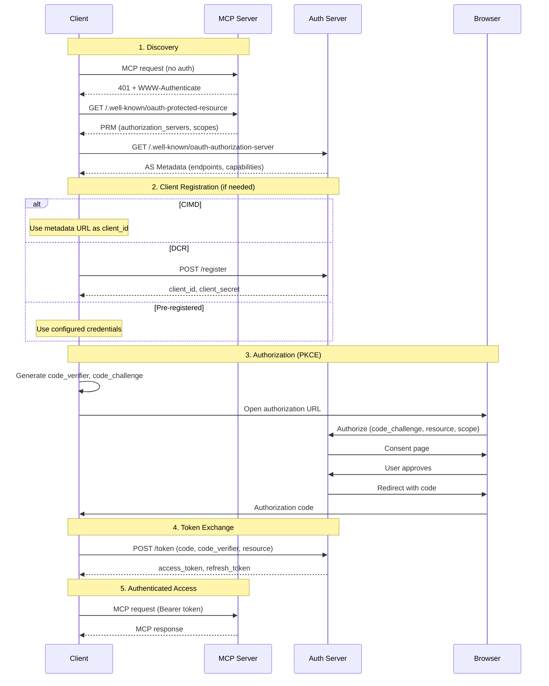

## Overview

MCP implements [OAuth 2.1](https://datatracker.ietf.org/doc/draft-ietf-oauth-v2-1/) for HTTP transports, enabling clients to access restricted servers on behalf of users. The implementation follows the [MCP Authorization Specification](https://modelcontextprotocol.io/specification/2025-11-25/basic/authorization).

**Key requirements:**
- **PKCE (S256)** - Mandatory for all authorization flows
- **Resource parameter** - Tokens are bound to specific MCP servers
- **Protected Resource Metadata** - Standard discovery mechanism

## Authorization Flow



## Discovery

### Protected Resource Metadata (PRM)

When connecting to an MCP server, `mcp-use` discovers how to authenticate:

**1. WWW-Authenticate header** (preferred)

```http
HTTP/1.1 401 Unauthorized
WWW-Authenticate: Bearer resource_metadata="https://mcp.example.com/.well-known/oauth-protected-resource",
                         scope="mcp:tools mcp:resources"
```

**2. Well-known URLs** (fallback)

```
/.well-known/oauth-protected-resource/path/to/mcp  (path-specific)
/.well-known/oauth-protected-resource              (root)
```

The PRM document tells the client which authorization servers to use:

```json
{
  "resource": "https://mcp.example.com/mcp",
  "authorization_servers": ["https://auth.example.com"],
  "scopes_supported": ["mcp:tools", "mcp:resources"]
}
```

### Authorization Server Metadata

For each authorization server in PRM, `mcp-use` discovers OAuth endpoints using two standards:

| Standard | URL Construction |
|----------|------------------|
| OAuth 2.0 ([RFC 8414](https://www.rfc-editor.org/rfc/rfc8414.html#section-3)) | Insert `.well-known` between host and path |
| OpenID Connect | Append `.well-known` to issuer |

For an issuer like `https://github.com/login/oauth`:

```
OAuth 2.0:  https://github.com/.well-known/oauth-authorization-server/login/oauth
OIDC:       https://github.com/login/oauth/.well-known/openid-configuration
```

<Note>
When the issuer has no path, both methods produce the same URL. `mcp-use` tries OAuth 2.0 style first, then falls back to OpenID Connect.
</Note>

## Client Registration

`mcp-use` supports three methods to obtain OAuth credentials, in priority order:

### 1. Pre-registered Credentials

Use existing OAuth app credentials:

```python
config = {
    "mcpServers": {
        "github": {
            "url": "https://api.githubcopilot.com/mcp/",
            "auth": {
                "client_id": "your-client-id",
                "client_secret": "your-client-secret",
                "scope": "repo",
                "callback_port": 8080
            }
        }
    }
}
```

<Tip>
Use this when your OAuth provider requires manual app registration (like GitHub).
</Tip>

### 2. Client ID Metadata Documents (CIMD)

CIMD lets you use a URL as your `client_id`. The authorization server fetches your client metadata from that URL.

**Create a metadata document** (host at a public HTTPS URL):

```json
{
  "client_id": "https://your-app.com/oauth/metadata.json",
  "client_name": "Your App",
  "redirect_uris": ["http://127.0.0.1:8080/callback"],
  "grant_types": ["authorization_code"],
  "response_types": ["code"],
  "token_endpoint_auth_method": "none"
}
```

**Configure mcp-use:**

```python
config = {
    "mcpServers": {
        "example": {
            "url": "https://mcp.example.com/mcp",
            "auth": {
                "client_metadata_url": "https://your-app.com/oauth/metadata.json"
            }
        }
    }
}
```

<Note>
CIMD is available when the authorization server advertises `client_id_metadata_document_supported: true`.
</Note>

### 3. Dynamic Client Registration (DCR)

When no credentials are configured and the server supports DCR, `mcp-use` registers automatically:

```python
config = {
    "mcpServers": {
        "linear": {
            "url": "https://mcp.linear.app/sse"
            # No auth config - uses DCR automatically
        }
    }
}
```

DCR sends a registration request to the `registration_endpoint`:

```json
{
  "client_name": "mcp-use",
  "redirect_uris": ["http://127.0.0.1:8080/callback"],
  "grant_types": ["authorization_code"],
  "response_types": ["code"],
  "token_endpoint_auth_method": "none"
}
```

Registered credentials are cached in `~/.mcp_use/tokens/registrations/`.

## PKCE (Required)

PKCE (Proof Key for Code Exchange) protects against authorization code interception attacks. `mcp-use` implements PKCE S256 for all OAuth flows.

**How it works:**

1. Client generates a random `code_verifier`
2. Client computes `code_challenge = BASE64URL(SHA256(code_verifier))`
3. Authorization request includes `code_challenge` and `code_challenge_method=S256`
4. Token request includes `code_verifier` for validation

<Warning>
Servers that don't support PKCE S256 are rejected. This is a security requirement of the MCP spec.
</Warning>

## Resource Parameter

Per [RFC 8707](https://datatracker.ietf.org/doc/html/rfc8707), `mcp-use` includes the `resource` parameter in authorization requests to bind tokens to specific MCP servers.

This prevents tokens from being used with unintended servers (confused deputy attacks).

## Scope Selection

`mcp-use` selects scopes in this order:

1. **WWW-Authenticate header** - Use `scope` from 401 response
2. **PRM document** - Use `scopes_supported` if no scope in header
3. **Configured scope** - Use your explicit `scope` configuration
4. **Omit** - Let the authorization server decide

## Configuration Reference

All OAuth parameters go inside the `auth` object of your server configuration:

```python
config = {
    "mcpServers": {
        "my_server": {
            "url": "https://mcp.example.com/mcp",
            "auth": {
                "client_id": "...",           # Pre-registered OAuth client ID
                "client_secret": "...",       # OAuth client secret (confidential clients only)
                "scope": "read write",        # Space-separated scopes to request
                "callback_port": 8080,        # Local callback port (default: 8080)
                "client_metadata_url": "...", # CIMD document URL
                "oauth_provider": { ... }     # Skip discovery with explicit metadata
            }
        }
    }
}
```

| Parameter | Type | Description |
|-----------|------|-------------|
| `client_id` | string | Pre-registered OAuth client ID |
| `client_secret` | string | OAuth client secret (confidential clients only) |
| `scope` | string | Space-separated scopes to request |
| `callback_port` | int | Local callback port (default: 8080) |
| `client_metadata_url` | string | CIMD document URL |
| `oauth_provider` | object | Skip discovery with explicit metadata |

### OAuth Provider (Skip Discovery)

If you know the OAuth endpoints, skip discovery:

```python
config = {
    "mcpServers": {
        "custom": {
            "url": "https://mcp.example.com/mcp",
            "auth": {
                "oauth_provider": {
                    "id": "custom",
                    "display_name": "Custom Server",
                    "metadata": {
                        "issuer": "https://auth.example.com",
                        "authorization_endpoint": "https://auth.example.com/authorize",
                        "token_endpoint": "https://auth.example.com/token",
                        "code_challenge_methods_supported": ["S256"]
                    }
                }
            }
        }
    }
}
```

## Token Storage

Tokens are stored locally and reused across sessions:

| Data | Location |
|------|----------|
| Access tokens | `~/.mcp_use/tokens/{server}.json` |
| Client registrations | `~/.mcp_use/tokens/registrations/{server}_registration.json` |

## Troubleshooting

<AccordionGroup>
  <Accordion title="Server requires PKCE S256" icon="shield-exclamation">
    The authorization server doesn't advertise `code_challenge_methods_supported: ["S256"]`.

    <Warning>
    PKCE S256 is required by the MCP spec. Contact the server administrator to enable it.
    </Warning>
  </Accordion>

  <Accordion title="OAuth server only supports CIMD" icon="file-code">
    The server has `client_id_metadata_document_supported: true` but no `registration_endpoint`.

    **Solution:** Configure a CIMD document URL:

    ```python
    "auth": {
        "client_metadata_url": "https://your-app.com/oauth/metadata.json"
    }
    ```
  </Accordion>

  <Accordion title="Port already in use" icon="plug">
    Another process is using port 8080.

    **Solution:** Use a different callback port:

    ```python
    "auth": {
        "callback_port": 8081
    }
    ```
  </Accordion>

  <Accordion title="Invalid redirect URI" icon="link-slash">
    Your OAuth app's registered redirect URI doesn't match the callback URL.

    **Solutions:**
    <Steps>
      <Step title="Update OAuth app">
        Add `http://127.0.0.1:8080/callback` to your OAuth app's allowed redirect URIs
      </Step>
      <Step title="Or use DCR">
        Remove `client_id` from config to use automatic registration
      </Step>
      <Step title="Or match the port">
        Set `callback_port` to match your registered redirect URI
      </Step>
    </Steps>
  </Accordion>
</AccordionGroup>

## Servers with OAuth Support

| Server | Registration | URL |
|--------|-------------|-----|
| Linear | DCR | `https://mcp.linear.app/sse` |
| Asana | DCR | `https://mcp.asana.com/sse` |
| Atlassian | DCR | `https://mcp.atlassian.com/v1/sse` |
| GitHub | Pre-registered | `https://api.githubcopilot.com/mcp/` |
