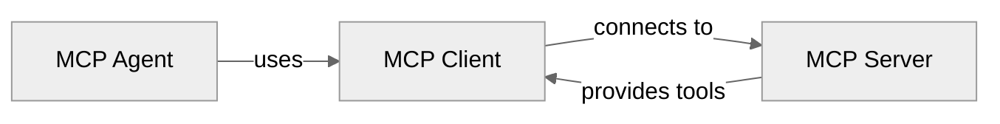

**mcp-use** is a unified MCP framework to build **MCP servers**, **MCP clients** and **MCP Agents**.



| Section | Description | |
|---------|-------------|---------|
| [Agent](#mcp-agent) | An AI Agent with tool calling capabilities through MCP connections | [Examples](https://github.com/mcp-use/mcp-use/tree/main/libraries/python/examples) |
| [Client](#mcp-client) | A full featured MCP Client implementation for Python with async support | [Examples](https://github.com/mcp-use/mcp-use/tree/main/libraries/python/examples) |
| [Server](#mcp-server) | The MCP Server framework implementation for Python | [Examples](https://github.com/mcp-use/mcp-use/tree/main/libraries/python/examples) |


## MCP Agent

**mcp-use** has a complete MCP Agent implementation for Python.
**MCP Agents** are AI-powered agents that can use tools from MCP servers to accomplish complex tasks. They reason across multiple steps, selecting and executing tools as needed.
Building such agents is easy with **mcp-use**, all you need is an LLM and the MCP Client.

<CodeGroup>
```bash pip
pip install mcp-use
```
```bash uv
uv add mcp-use
```
```bash poetry
poetry add mcp-use
```
</CodeGroup>

Here's a simple example to get you started for an agent with **browser tools** support.

```python
import asyncio
from langchain_openai import ChatOpenAI  # use your preferred LLM provider
from mcp_use import MCPAgent, MCPClient

async def main():
    # Create MCPClient from configuration object
    client = MCPClient({
        "mcpServers": {
            "playwright": {
                "command": "npx",
                "args": ["@playwright/mcp@latest"],
                "env": {
                    "DISPLAY": ":1"
                }
            }
        }
    })

    # Create agent with the client
    agent = MCPAgent(
        llm=ChatOpenAI(model="gpt-4o"),  # use your preferred LLM provider
        client=client,
        max_steps=30
    )

    # Run the query
    result = await agent.run(
        "Find the best restaurant in San Francisco USING GOOGLE SEARCH"
    )
    print(f"\nResult: {result}")

    # Clean up
    await client.close_all_sessions()

if __name__ == "__main__":
    asyncio.run(main())
```

<Tip>
For multi-server setups, tool restrictions, and advanced configuration options, see the [Agent Configuration](/python/agent/agent-configuration) and [Client Configuration](/python/client/client-configuration) guides.
</Tip>

For a complete overview of the mcp-use MCP Agent, see the [MCP Agent](/python/agent/building-custom-agents) documentation.


### Available MCP Servers

mcp-use supports **any MCP server**. Check out the [Awesome MCP Servers](https://github.com/punkpeye/awesome-mcp-servers) list for available options.
Or deploy your own following the instruction [below](#mcp-server).


## MCP Client

**mcp-use** has a complete MCP Client implementation for Python with full async support.
It supports stdio and HTTP with SSE transports for connecting to any MCP server.

<CodeGroup>
```bash pip
pip install mcp-use
```
```bash uv
uv add mcp-use
```
```bash poetry
poetry add mcp-use
```
</CodeGroup>

Then create a new MCP Client:

```python
import asyncio
from mcp_use import MCPClient

async def main():
    client = MCPClient({
        "mcpServers": {
            "everything": {
                "command": "npx",
                "args": ["-y", "@modelcontextprotocol/server-everything"]
            }
        }
    })

    # Initialize all configured sessions
    await client.create_all_sessions()

    # Get the session for a specific server
    session = client.get_session("everything")

    # List available tools
    tools = await session.list_tools()
    print(f"Available tools: {[t.name for t in tools]}")

    # Call a specific tool with arguments
    result = await session.call_tool("add", {"a": 1, "b": 2})
    print(f"Result: {result}")

    # Clean up
    await client.close_all_sessions()

if __name__ == "__main__":
    asyncio.run(main())
```

To learn more about the MCP Client, see the [MCP Client](/python/client/connection-types) documentation.

## MCP Server

**mcp-use** has a complete MCP server framework implementation for Python.
It supports all official MCP features including tools, resources, prompts, and middleware.

<CodeGroup>
```bash pip
pip install mcp-use
```
```bash uv
uv add mcp-use
```
```bash poetry
poetry add mcp-use
```
</CodeGroup>

Create a simple MCP server:

```python
from mcp_use import MCPServer

server = MCPServer(
    name="my-server",
    version="1.0.0",
    description="My custom MCP server"
)

# Define a tool
@server.tool()
def get_weather(city: str) -> dict:
    """Get weather for a city"""
    return {"temperature": 72, "condition": "sunny", "city": city}

# Start the server
if __name__ == "__main__":
    server.run()
```

To learn more about the MCP Server, see the [MCP Server](/python/server) documentation.

---


## Next Steps

<CardGroup cols={3}>
  <Card title="Agent Configuration" icon="cog" href="/python/agent/agent-configuration">
    Configure your Agent and connected MCP servers
  </Card>
  <Card title="LLM Integration" icon="brain" href="/python/agent/llm-integration">
    Explore supported LLM providers and their setup
  </Card>
  <Card title="Examples" icon="code" href="https://github.com/mcp-use/mcp-use/tree/main/libraries/python/examples">
    Browse real-world examples and use cases
  </Card>
</CardGroup>

<Tip>
**Need Help?** Join our [Discord](https://discord.gg/XkNkSkMz3V) or [Github](https://github.com/mcp-use/mcp-use) communities.
</Tip>
