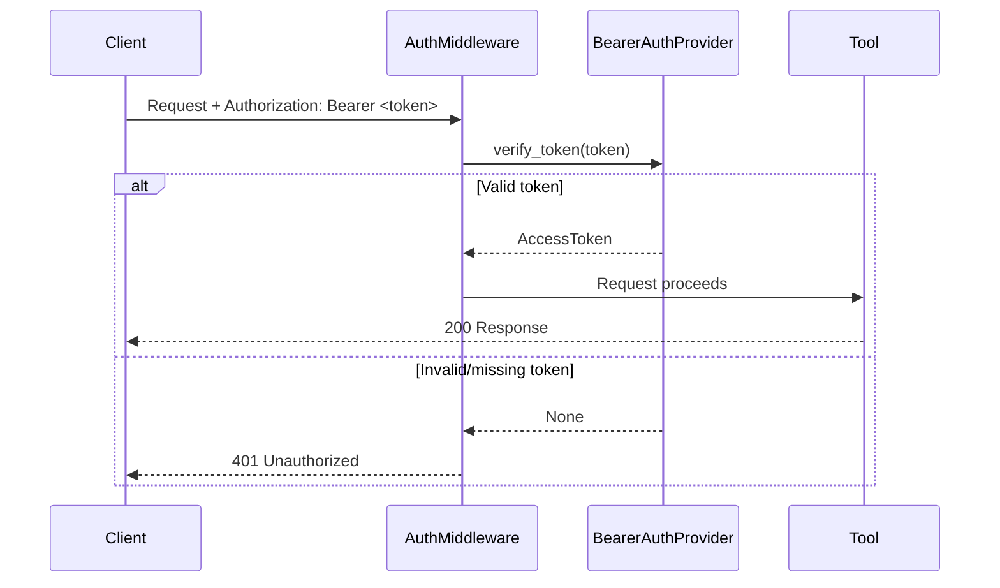

Protect your MCP server with bearer token authentication. Invalid tokens return HTTP 401 responses before reaching your MCP handlers.

## What Gets Protected

When you configure `auth=MyAuthProvider()`, **all MCP endpoints are automatically protected**:

- All tools
- All resources
- All prompts

No additional code is needed in individual tools. The middleware validates the token at the HTTP layer and rejects invalid requests with 401 before your code runs.

## Quick Start

```python
from mcp_use.server import MCPServer
from mcp_use.server.auth import BearerAuthProvider, AccessToken, get_access_token

API_KEYS = {
    "sk-abc123": {"email": "alice@example.com"},
    "sk-def456": {"email": "bob@example.com"},
}


class MyAuthProvider(BearerAuthProvider):
    async def verify_token(self, token: str) -> AccessToken | None:
        if token not in API_KEYS:
            return None
        return AccessToken(token=token, claims=API_KEYS[token])


server = MCPServer(name="my-server", auth=MyAuthProvider())


@server.tool()
def whoami() -> str:
    """Get current user info."""
    token = get_access_token()
    return f"Hello {token.claims.get('email')}" if token else "Not authenticated"
```

## How It Works



## BearerAuthProvider

Extend this class and implement `verify_token()`:

```python
from mcp_use.server.auth import BearerAuthProvider, AccessToken


class MyAuthProvider(BearerAuthProvider):
    async def verify_token(self, token: str) -> AccessToken | None:
        # Return AccessToken if valid, None if invalid
        ...
```

## AccessToken

| Field | Type | Description |
|-------|------|-------------|
| `token` | `str` | The original bearer token |
| `claims` | `dict[str, Any]` | User info dictionary |
| `scopes` | `list[str]` | Permission list (default: `[]`) |

### claims

The `claims` dictionary stores user information that your tools can access during request handling. You decide what to include based on your application's needs.

**Common fields:**
- `sub` - User ID (standard JWT claim)
- `email` - User's email address
- `name` - Display name
- Custom fields like `plan`, `org_id`, `role`, etc.

```python
AccessToken(
    token=token,
    claims={
        "sub": "user-123",
        "email": "alice@example.com",
        "name": "Alice",
        "plan": "pro",
    },
)
```

**Accessing claims in tools:**

```python
@server.tool()
def get_user_plan() -> str:
    token = get_access_token()
    if not token:
        return "Not authenticated"

    email = token.claims.get("email", "unknown")
    plan = token.claims.get("plan", "free")
    return f"{email} is on the {plan} plan"
```

### scopes

Use for permission checks in your tools:

```python
AccessToken(
    token=token,
    claims={"email": "alice@example.com"},
    scopes=["read", "write", "admin"],
)
```

Check in tools via `"admin" in token.scopes`.

## Accessing Token Data in Tools

Since the middleware already validates authentication, these helpers are for **accessing user information** from the token - not for protection.

| Function | Purpose |
|----------|---------|
| `get_access_token()` | Returns `AccessToken` or `None`. Use when auth is optional or to access claims. |
| `require_auth()` | Returns `AccessToken` or raises `AuthenticationError`. Use as a safeguard. |

```python
from mcp_use.server.auth import get_access_token, require_auth


@server.tool()
def get_user_data() -> dict:
    # User is already authenticated (middleware validated the token)
    # We're just accessing their info here
    token = get_access_token()
    return {"email": token.claims.get("email")}


@server.tool()
def admin_action() -> str:
    # require_auth() is a safeguard - useful if you want to be explicit
    # or if the endpoint might be called from an excluded path
    token = require_auth()
    if "admin" not in token.scopes:
        return "Admin scope required"
    return "Done"
```

## Client Configuration

```json
{
  "mcpServers": {
    "my-server": {
      "url": "http://localhost:8000/mcp",
      "headers": {
        "Authorization": "Bearer your-api-key"
      }
    }
  }
}
```

## HTTP Responses

| Scenario | Status | Response |
|----------|--------|----------|
| No token | 401 | `{"error": "unauthorized", "error_description": "Authentication required"}` |
| Invalid token | 401 | `{"error": "invalid_token", "error_description": "Token is invalid or expired"}` |
| Valid token | 200 | Request proceeds |

All 401 responses include the `WWW-Authenticate: Bearer` header.

<Note>
All MCP protocol traffic (`/mcp/*`) requires authentication - this includes all tools, resources, and prompts. Debug paths like `/docs`, `/inspector`, `/health`, and `/openmcp.json` are excluded by default.
</Note>
