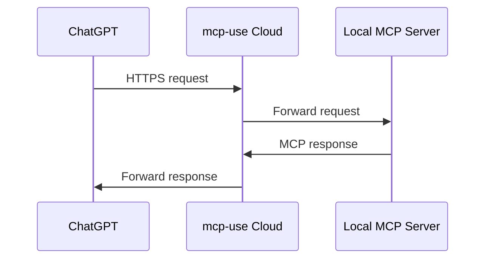

The tunnel creates a secure connection between ChatGPT (or other MCP clients) and your local MCP server:



## Use Case

Tunneling is perfect for:

- **Testing before deployment**: Verify your MCP server works with real clients
- **Development workflow**: Iterate quickly without deploying each change
- **Client integration**: Test with ChatGPT, Claude, or other MCP clients
- **Debugging**: Troubleshoot connection issues in a production-like environment


## Quick Start

<Tip>
This guide references mcp-use server, but you can use tunneling with any MCP server as long as they are served on the `/mcp` path.
</Tip>

<Tip>
If you're using `mcp-use start`, you can pass the `--tunnel` flag to automatically create a tunnel without running a separate command:
```bash
mcp-use start --port 3000 --tunnel
```
</Tip>

<Steps>
<Step title="Define Your Server">
Create your MCP server with tools and resources:

<CodeGroup>
```bash via cli
npx create-mcp-use-app my-mcp-server
```

```typescript manual
import { MCPServer, text } from 'mcp-use/server'
import { z } from 'zod'
const server = new MCPServer({
  name: 'my-server',
  version: '1.0.0',
  description: 'My MCP server'
})

server.tool({
  name: 'echo',
  description: 'Echo back the provided message',
  schema: z.object({
    message: z.string().describe('The message to echo back'),
  }),
}, async ({ message }) => {
  return text(`Echo: ${message}`);
})
```
</CodeGroup>
</Step>
<Step title="Start Your Local MCP Server">
Start your MCP server on a local port (e.g., port 3000):

```bash
mcp-use start --port 3000
```

</Step>

<Step title="Create a Tunnel">
Use the tunnel command to expose your local server:

```bash
npx @mcp-use/tunnel 3000
```

This will create a public URL that forwards to your local server. Learn more about the [@mcp-use/tunnel package](https://www.npmjs.com/package/@mcp-use/tunnel).
</Step>

<Step title="Use the Public URL">
The command will output a public URL like:

```
╭────────────────────────────╮
│  🎉 Tunnel Created Successfully!           │
╰────────────────────────────╯

  🌐 Public URL:
     https://happy-blue-cat.local.mcp-use.run/mcp

  📍 Subdomain: happy-blue-cat
  🔌 Local Port: 3000
```

Use this URL to connect your MCP client (ChatGPT, Claude, etc.) to your local server.
</Step>
</Steps>


<Info>
**Time Limits:**
- Tunnels automatically expire after **24 hours** of creation
- Inactive tunnels are cleaned up after **1 hour** of no activity

**Rate Limiting:**
- Maximum **10 tunnel creations per IP per hour**
- Maximum **5 active tunnels per IP** at any time
- These limits help ensure fair usage and prevent abuse
</Info>

<Warning>
The tunnel is active only while the command is running. Press `Ctrl+C` to close the tunnel when you're done testing.
</Warning>

<Tip>
Keep the terminal window open while testing. The tunnel closes when you stop the command.
</Tip>

