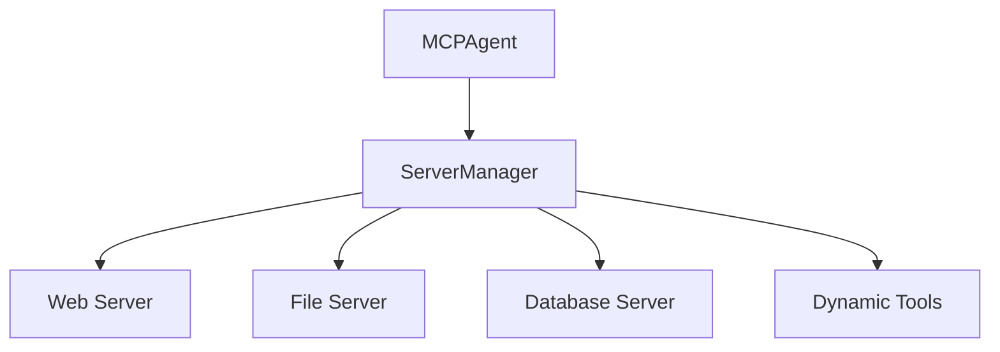
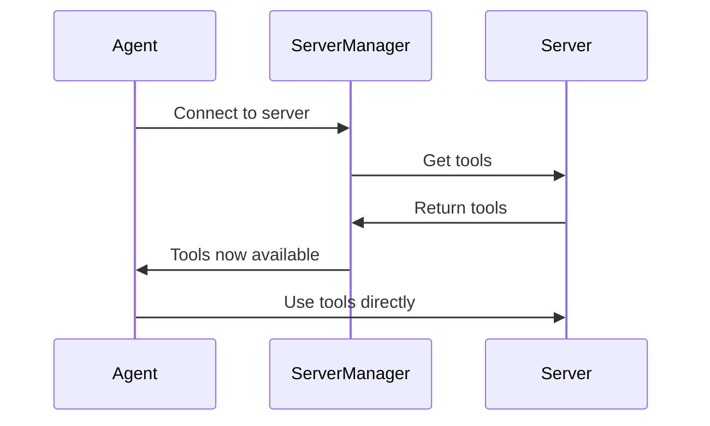

The Server Manager enables intelligent orchestration of multiple MCP servers, allowing agents to dynamically discover, connect to, and utilize tools from different servers without loading everything upfront.

## Why Use Server Manager?

When working with multiple MCP servers, you face a challenge: each server can expose dozens of tools, and loading all tools from all servers into your agent's context can be overwhelming and inefficient.

The Server Manager solves this by:

- **Dynamic loading**: Load tools only when needed, not everything upfront
- **Intelligent routing**: Automatically select the right server for each task
- **Context optimization**: Keep agent context focused and efficient
- **Automatic discovery**: Find and connect to the right tools automatically
- **Lifecycle management**: Handle connections and cleanup automatically

<Tip>
**Best for multi-server setups**: If you're connecting to 3+ servers or dealing with 20+ total tools, the Server Manager significantly improves agent performance and context efficiency.
</Tip>

## Architecture Overview



## Dynamic Tool Loading Process



## Getting Started

Enable the Server Manager in your agent:

<CodeGroup>
```typescript TypeScript
import { MCPClient, MCPAgent } from 'mcp-use'
import { ChatOpenAI } from '@langchain/openai'

// Create client with multiple servers
const client = new MCPClient({
    mcpServers: {
        playwright: {
            command: 'npx',
            args: ['@playwright/mcp@latest']
        },
        filesystem: {
            command: 'uvx',
            args: ['mcp-server-filesystem', '/tmp']
        }
    }
})

// Enable Server Manager
const agent = new MCPAgent({
    llm: new ChatOpenAI({ model: 'gpt-4o' }),
    client,
    useServerManager: true  // This is the magic switch!
})
```

</CodeGroup>

## Tool Discovery Flow

The agent uses the management tools to discover and connect to servers:

1. **List available servers**: Use `list_mcp_servers` to see what servers are configured
2. **Connect to a server**: Use `connect_to_mcp_server` to activate a server and load its tools
3. **Use server tools**: Once connected, the server's tools become available to the agent
4. **Switch servers**: Connect to a different server to access its tools
5. **Disconnect**: Use `disconnect_from_mcp_server` to deactivate the current server

## Management Tools Deep Dive

### Core Server Management

| Tool | Purpose | Example |
|------|---------|---------|
| `list_mcp_servers` | Discovery of available servers and their tools | "What servers do I have access to?" |
| `connect_to_mcp_server` | Activate a server and load its tools | "Connect to the filesystem server" |
| `get_active_mcp_server` | Check current connection status | "Which server am I currently using?" |
| `disconnect_from_mcp_server` | Deactivate server and remove its tools | "Disconnect from current server" |
| `add_mcp_server_from_config` | Add a new server dynamically from configuration | "Add a new server with this configuration" |


## Complete Example

```typescript 
import { MCPClient, MCPAgent } from 'mcp-use'
import { ChatOpenAI } from '@langchain/openai'

async function demoServerManager() {
    // Multi-server configuration
    const client = new MCPClient({
        mcpServers: {
            web: { command: 'npx', args: ['@playwright/mcp@latest'] },
            files: { command: 'uvx', args: ['mcp-server-filesystem', '/tmp'] },
            database: { command: 'uvx', args: ['mcp-server-sqlite'] }
        }
    })

    // Agent with Server Manager
    const agent = new MCPAgent({
        llm: new ChatOpenAI({ model: 'gpt-4o' }),
        client,
        useServerManager: true,
        verbose: true  // See the magic happen!
    })

    // Complex multi-server task
    const result = await agent.run(`
    I need to build a complete data collection system:

    1. First, show me what servers and tools are available
    2. Scrape product information from https://example-store.com
    3. Clean and structure the data
    4. Save it as both JSON and CSV files
    5. Load the data into a SQLite database
    6. Generate a summary report

    Guide me through each step and show me how you discover and use the right tools.
    `)

    console.log('Task completed!')
    console.log(result)

    await client.closeAllSessions()
}

demoServerManager().catch(console.error)
```


The Server Manager transforms your MCP agent from a static tool user into an intelligent, adaptive assistant that can dynamically discover and utilize the perfect tools for any task!


