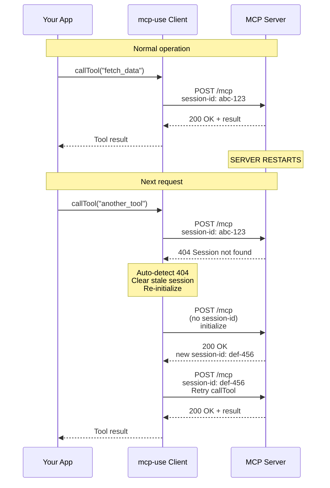

The MCPClient is your gateway to connecting with MCP servers. This guide covers all configuration options for establishing connections, managing sessions, and customizing client behavior.

<Info>
  **Looking for agent configuration?** If you're building AI agents that
  interact with MCP servers, see the [Agent
  Configuration](/typescript/agent/agent-configuration) guide instead.
</Info>

<Tip>
  **Using in browser or React?** This guide uses the Node.js import (`mcp-use`).
  For browser or React environments, see the
  [Environments](/typescript/client/environments) guide to learn about the
  different entry points.
</Tip>

## Quick Start

<CodeGroup>
```typescript TypeScript
import { MCPClient } from 'mcp-use'

// Configure your MCP servers
const config = {
mcpServers: {
playwright: {
command: 'npx',
args: ['@playwright/mcp@latest'],
env: { DISPLAY: ':1' }
}
}
}

const client = new MCPClient(config)

````
</CodeGroup>


## Connection Types

MCP servers communicate with clients using different transport protocols. The mcp-use client supports multiple connection types, each optimized for different use cases.

### Supported Connection Types

The client supports two primary connection types:

- **STDIO**: Local process communication via standard input/output
- **HTTP/SSE**: Remote servers via HTTP with Server-Sent Events

<Tip>
The connection type is automatically detected based on your server configuration. You don't need to specify it explicitly - just provide the appropriate parameters (`command` for STDIO, `url` for HTTP).
</Tip>

### When to Use Each Type

| Connection Type | Best For | Use Cases |
|----------------|----------|-----------|
| **STDIO** | Local development | Testing servers locally, file system access, no network setup needed |
| **HTTP/SSE** | Production deployment | Remote servers, load balancing, authentication, multiple clients |

<Note>
**Transport Migration Notice (MCP Spec 2025-11-25)**

The old SSE transport (separate POST and SSE endpoints) is deprecated in favor of **Streamable HTTP** (unified endpoint).

**Your existing code still works!** The `sse` transport option is maintained for backward compatibility.

**What changed:**
- **Old way**: POST `/messages` for requests, GET `/sse` for notifications (two endpoints)
- **New way**: POST `/mcp` and GET `/mcp` (one unified endpoint)
- **SSE still works** for notifications - just through the unified endpoint

**Migration (when convenient):**

```typescript
// Old (deprecated, but still works)
const mcp = useMcp({
  url: 'http://localhost:3000/sse',
  transportType: 'sse'
});

// New (recommended)
const mcp = useMcp({
  url: 'http://localhost:3000/mcp',
  transportType: 'http'  // or 'auto'
});
````

**No action required** for existing code. Migrate at your own pace.

Learn more: [MCP Spec - Streamable HTTP](https://modelcontextprotocol.io/specification/2025-11-25/basic/transports#streamable-http)

</Note>

## Automatic Session Management

mcp-use clients automatically handle session lifecycle and recovery per the [MCP specification](https://modelcontextprotocol.io/specification/2025-11-25/basic/transports#session-management).

### Automatic 404 Recovery

When using HTTP/SSE transports, the client automatically handles server restarts and expired sessions:



**How it works:**

1. Client makes request with session ID
2. Server returns 404 (session expired or server restarted)
3. **Client automatically**:
   - Detects 404 error with active session
   - Clears stale session ID
   - Sends new `initialize` request
   - Retries original request with new session
4. Original request succeeds - **completely transparent to your app**

**Benefits:**

- ✅ No manual reconnection required
- ✅ Seamless recovery from server restarts
- ✅ Works for both HTTP and SSE transports
- ✅ Complies with MCP specification
- ✅ Automatic in inspector, React hooks, and Node.js clients

**Logging:**

Watch for these log messages to see automatic recovery in action:

```
[StreamableHttp] Session not found (404), re-initializing per MCP spec...
[StreamableHttp] Re-initialization successful, retrying request
```

### Session Persistence

HTTP/SSE connections maintain session state across requests:

- **Session ID**: Automatically managed by the client
- **Client capabilities**: Preserved across requests
- **Server capabilities**: Cached after initialization
- **Subscriptions**: Maintained for resource updates

STDIO connections are stateless and don't use sessions.

## Server Configuration

The MCPClient uses a flexible configuration system that supports any MCP server, regardless of connection type.

<Tip>
  **Looking for MCP servers?** Check out these curated lists: -
  [punkpeye/awesome-mcp-servers](https://github.com/punkpeye/awesome-mcp-servers)
  -
  [appcypher/awesome-mcp-servers](https://github.com/appcypher/awesome-mcp-servers)
</Tip>

### Configuration Structure

Server configuration is defined as a JavaScript object:

```json
{
  "mcpServers": {
    "server_name": {
      "command": "command_to_run",
      "args": ["arg1", "arg2"],
      "env": {
        "ENV_VAR": "value"
      }
    }
  }
}
```

### Configuration Parameters

Each server entry requires a unique name and connection-specific parameters. The client automatically detects the connection type based on the provided configuration.

**Common Parameters:**

- `server_name`: Unique identifier for the server (used as the object key)

**STDIO Servers (Local Process):**

For servers that run as local child processes:

- `command`: Executable command to start the server (e.g., `"npx"`, `"python"`)
- `args`: Array of command-line arguments
- `env`: Environment variables for the server process
- `clientInfo`: (Optional) Client information sent to the server in the initialize request. If not provided, defaults to mcp-use client info.

**Example:**

```json
{
  "mcpServers": {
    "stdio_server": {
      "command": "npx",
      "args": ["@my-mcp/server"],
      "env": {},
      "clientInfo": {
        "name": "My Custom Client",
        "title": "My Custom Client Display Name",
        "version": "1.0.0"
      }
    }
  }
}
```

**HTTP/HTTPS Servers (Remote):**

For servers accessible via HTTP endpoints:

- `url`: Full URL to the MCP server endpoint
- `headers`: Custom HTTP headers (useful for authentication)
- `clientInfo`: (Optional) Client information sent to the server in the initialize request. If not provided, defaults to mcp-use client info.

**Example:**

```json
{
  "mcpServers": {
    "http_server": {
      "url": "http://localhost:3000",
      "headers": {
        "Authorization": "Bearer ${AUTH_TOKEN}"
      },
      "clientInfo": {
        "name": "My Custom Client",
        "title": "My Custom Client Display Name",
        "version": "1.0.0",
        "description": "A custom MCP client application",
        "icons": [
          {
            "src": "https://example.com/icon.png",
            "mimeType": "image/png",
            "sizes": ["48x48"]
          }
        ],
        "websiteUrl": "https://example.com"
      }
    }
  }
}
```

**Client Info Structure:**

The `clientInfo` parameter allows you to customize how your client identifies itself to MCP servers:

- `name` (required): Client identifier name
- `title` (optional): Display name for the client
- `version` (required): Client version string
- `description` (optional): Human-readable description of the client
- `icons` (optional): Array of icon objects with `src`, `mimeType`, and `sizes` properties
- `websiteUrl` (optional): URL to the client's website

**Default Client Info:**

If `clientInfo` is not specified, mcp-use automatically uses:

- `name`: `"mcp-use"`
- `title`: `"mcp-use"`
- `version`: Current mcp-use package version
- `description`: `"mcp-use is a complete TypeScript framework for building and using MCP"`
- `icons`: `[{"src": "https://mcp-use.com/logo.png"}]`
- `websiteUrl`: `"https://mcp-use.com"`

### Example Configuration

Here's a basic example of how to configure an MCP server:

```json
{
  "mcpServers": {
    "my_server": {
      "command": "npx",
      "args": ["@my-mcp/server"],
      "env": {
        "PORT": "3000"
      }
    }
  }
}
```

### Multiple Server Configuration

You can configure multiple MCP servers in a single configuration file, allowing you to use different servers for different tasks or combine their capabilities (e.g.):

```json
{
  "mcpServers": {
    "airbnb": {
      "command": "npx",
      "args": ["-y", "@openbnb/mcp-server-airbnb", "--ignore-robots-txt"]
    },
    "playwright": {
      "command": "npx",
      "args": ["@playwright/mcp@latest"],
      "env": { "DISPLAY": ":1" }
    },
    "filesystem": {
      "command": "npx",
      "args": [
        "-y",
        "@modelcontextprotocol/server-filesystem",
        "/home/pietro/projects/mcp-use/"
      ]
    }
  }
}
```

For a complete example of using multiple servers, see the [multi-server example](https://github.com/mcp-use/mcp-use/blob/main/examples/multi_server_example.py) in our repository.

## Client Creation Methods

There are several ways to create an MCPClient:

### From Dictionary/Object

Create configuration programmatically:

```typescript TypeScript
import { MCPClient } from "mcp-use";

const config = {
  mcpServers: {
    playwright: {
      command: "npx",
      args: ["@playwright/mcp@latest"],
      env: { DISPLAY: ":1" },
    },
  },
};

const client = new MCPClient(config);
```

### From Configuration File

Load configuration from a JSON file:

<CodeGroup>
```typescript TypeScript
import { MCPClient, loadConfigFile } from 'mcp-use'

const config = await loadConfigFile('config.json')
const client = new MCPClient(config)

````

```typescript TypeScript
import { MCPClient, loadConfigFile } from 'mcp-use'

const config = await loadConfigFile('config.json')
const client = new MCPClient(config)
````

</CodeGroup>

### With Sandbox Options

Enable sandboxed execution:

<CodeGroup>
```typescript TypeScript
// Note: Sandbox mode is not yet supported in the TypeScript library
// This is a planned feature for a future release
```

```typescript TypeScript
// Note: Sandbox mode is not yet supported in the TypeScript library
// This is a planned feature for a future release
```

</CodeGroup>

## Best Practices

1. **API Keys**: Always use environment variables for sensitive information
2. **Configuration Files**: Keep configuration files in version control (without sensitive data)
3. **Server Naming**: Use descriptive names for your MCP servers
4. **Environment Variables**: Set appropriate environment variables for each server
5. **Testing**: Test server connections independently before using with agents
6. **Monitoring**: Enable logging to monitor server connection health

## Error Handling

Common client configuration errors and solutions:

1. **Server Not Found**: Check if the server command is installed and accessible
2. **Connection Timeout**: Verify server is running and network connectivity
3. **Permission Denied**: Ensure proper file permissions and environment setup
4. **Invalid Configuration**: Validate JSON syntax and required fields
