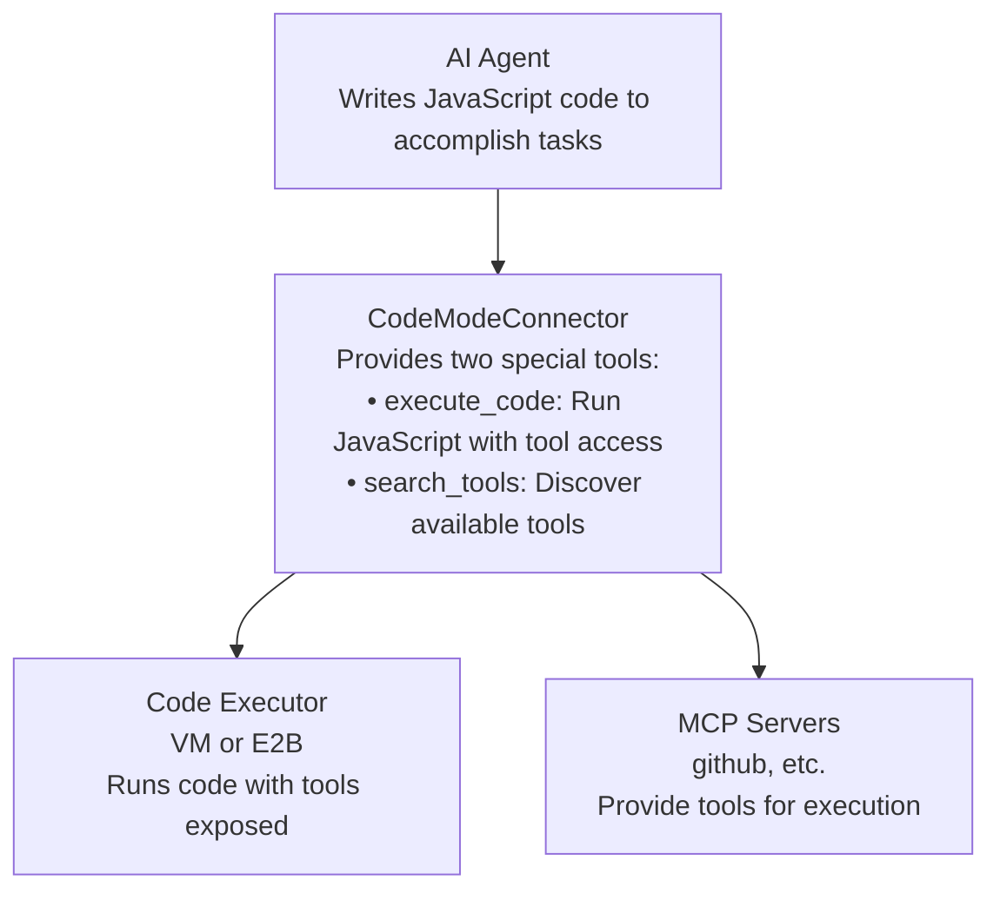

Code Mode enables AI agents to interact with MCP tools by writing and executing JavaScript/TypeScript code instead of making individual tool calls. This dramatically improves efficiency for complex tasks, data processing, and multi-step workflows.

<video alt="Code Mode Example" style={{maxWidth: '600px', borderRadius: '8px', marginBottom: '1.5rem', boxShadow: '0 2px 12px rgba(0,0,0,0.08)'}} muted autoPlay loop>
  <source src="/images/code_mode.mp4" type="video/mp4" />
</video>

## Why Code Mode?

Based on [Anthropic's research on code execution with MCP](https://www.anthropic.com/engineering/code-execution-with-mcp), code mode provides:

- **Better efficiency**: Batch multiple operations in a single code execution
- **Reduced context**: Less back-and-forth between agent and tools
- **Complex logic**: Enable sophisticated data processing and transformations
- **Natural workflow**: Agents write code the way developers do

<Warning>
**Security Considerations**: Code Mode executes user-generated code. Always use appropriate sandboxing:
- **VM Executor**: Basic local sandboxing for trusted environments
- **E2B Executor**: Strong cloud-based isolation for production use
</Warning>

## Executor Types

Code Mode supports three executor types:

### VM Executor (Default)

Local execution using Node.js `vm` module. Fast and simple, suitable for trusted environments.

**Advantages:**

- Zero latency - direct function calls
- No external dependencies
- Immediate execution
- No cost

**Limitations:**

- Basic isolation (not suitable for untrusted code)
- Limited to Node.js built-ins
- Shares host resources

**Basic Setup:**

The simplest way to enable Code Mode with local execution:

```typescript
import { MCPClient } from "mcp-use";
import { MCPAgent } from "mcp-use/agent";
import { PROMPTS } from "mcp-use/client/prompts";

const client = new MCPClient(
  {
    mcpServers: {
      filesystem: {
        command: "npx",
        args: ["-y", "@modelcontextprotocol/server-filesystem", "./data"],
      },
    },
  },
  { codeMode: true } // Enable code mode with default VM executor
);

const agent = new MCPAgent({
  llm,
  client,
  systemPrompt: PROMPTS.CODE_MODE, // Use code mode instructions
});

// Agent can now write code to use tools
const result = await agent.run("List all files and count them");
```

**Custom Timeout:**

Customize the VM executor timeout:

```typescript
const client = new MCPClient(
  {
    /* server config */
  },
  {
    codeMode: {
      enabled: true,
      executor: "vm", // Default, can be omitted
      executorOptions: {
        timeoutMs: 60000, // 1 minute (default: 30 seconds)
        memoryLimitMb: 512, // Optional memory limit
      },
    },
  }
);
```

### E2B Executor

Remote execution in E2B cloud sandboxes. Provides strong isolation for production use.

**Advantages:**

- True isolation in cloud sandbox
- Full Linux environment
- Network and filesystem access
- Persistent sandboxes
- Suitable for untrusted code

**Limitations:**

- Network latency overhead
- Requires E2B API key and billing
- More complex debugging

**Setup:**

1. **Install dependency:**

```bash
yarn add @e2b/code-interpreter
```

2. **Get API key:**
   Visit [e2b.dev](https://e2b.dev) and create an account to get your API key.

3. **Configure client:**

For production or untrusted code, use E2B for stronger isolation:

```typescript
const client = new MCPClient(
  {
    /* server config */
  },
  {
    codeMode: {
      enabled: true,
      executor: "e2b",
      executorOptions: {
        apiKey: process.env.E2B_API_KEY!,
        timeoutMs: 300000, // 5 minutes (default)
      },
    },
  }
);
```

4. **Set environment variable:**

```bash
export E2B_API_KEY=your_api_key_here
```

### Custom Executor

Implement your own execution logic for specialized requirements.

**Custom Function:**

```typescript
const client = new MCPClient(config, {
  codeMode: {
    enabled: true,
    executor: async (code: string, timeout?: number) => {
      // Your custom execution logic
      const result = await myCustomRuntime.execute(code);

      return {
        result: result.value,
        logs: result.console,
        error: result.error,
        execution_time: result.duration,
      };
    },
  },
});
```

**Custom Class:**

```typescript
import { BaseCodeExecutor } from "mcp-use";

class MyExecutor extends BaseCodeExecutor {
  async execute(code: string, timeout?: number): Promise<ExecutionResult> {
    await this.ensureServersConnected(); // Connect to MCP servers
    const namespaces = this.getToolNamespaces(); // Get available tools

    // Your execution logic here
    return { result, logs, error, execution_time };
  }

  async cleanup(): Promise<void> {
    // Clean up resources
  }
}

const client = new MCPClient(config, {
  codeMode: {
    enabled: true,
    executor: new MyExecutor(client),
  },
});
```

## How Agent Code Works


Code Mode uses a layered architecture to provide flexible code execution with MCP tool access:



When Code Mode is active, the agent writes JavaScript code that has access to:

### 1. Tool Namespaces

Tools are exposed as `serverName.toolName(args)` async functions:

```javascript
// Call GitHub MCP server tools
const prs = await github.list_pull_requests({
  owner: "facebook",
  repo: "react",
});

// Call filesystem MCP server tools
const files = await filesystem.list_directory({ path: "/data" });
```

### 2. Tool Discovery

Use `search_tools()` to discover available tools at runtime:

```javascript
// Find all tools (returns full schemas)
const allResult = await search_tools();
const allTools = allResult.results;
console.log(`Found ${allResult.meta.result_count} tools out of ${allResult.meta.total_tools} total`);

// Search for specific tools
const githubResult = await search_tools("github");
const githubTools = githubResult.results;

// Get just names and servers
const namesResult = await search_tools("", "names");
const toolNames = namesResult.results;

// Get names and descriptions
const descsResult = await search_tools("", "descriptions");
const toolDescs = descsResult.results;
```

### 3. Standard JavaScript

Full access to JavaScript built-ins for data processing:

```javascript
// Filter and map data
const openBugs = prs.filter(
  (pr) => pr.labels.some((l) => l.name === "bug") && pr.state === "open"
);

// Aggregate results
const summary = {
  total: prs.length,
  open: openBugs.length,
  titles: openBugs.map((pr) => pr.title),
};

return summary;
```


## Advanced Topics

### Timeout Configuration

Control execution timeouts at different levels:

```typescript
// Sandbox-level timeout (E2B)
const client = new MCPClient(config, {
  codeMode: {
    enabled: true,
    executor: "e2b",
    executorOptions: {
      apiKey: process.env.E2B_API_KEY!,
      timeoutMs: 600000, // 10 minutes for long-running tasks
    },
  },
});

// VM executor with custom timeout
const client = new MCPClient(config, {
  codeMode: {
    enabled: true,
    executor: "vm",
    executorOptions: {
      timeoutMs: 60000, // 1 minute default timeout
    },
  },
});

// Per-execution timeout (overrides default)
const result = await client.executeCode(code, 30000); // 30 seconds for this execution
```

### Error Handling

Code execution errors are captured in the result:

```typescript
const result = await client.executeCode(`
  try {
    const data = await github.get_pull_request({ number: 12345 });
    return data;
  } catch (error) {
    console.error("Failed to fetch PR:", error.message);
    return { error: error.message };
  }
`);

if (result.error) {
  console.error("Execution failed:", result.error);
  console.log("Logs:", result.logs);
} else {
  console.log("Result:", result.result);
  console.log("Execution time:", result.execution_time);
}
```

### Tool Discovery Patterns

Different ways to discover tools based on your needs:

```javascript
// Quick overview - just names
const namesResult = await search_tools("", "names");
const names = namesResult.results;
// [{ name: "list_issues", server: "github" }, ...]

// With descriptions for better understanding
const withDescResult = await search_tools("file", "descriptions");
const withDesc = withDescResult.results;
// [{ name: "read_file", server: "filesystem", description: "..." }, ...]

// Full schemas for validation
const fullResult = await search_tools("github", "full");
const full = fullResult.results;
// [{ name: "...", server: "...", description: "...", input_schema: {...} }]

// Access metadata
console.log(`Total tools: ${fullResult.meta.total_tools}`);
console.log(`Namespaces: ${fullResult.meta.namespaces.join(", ")}`);

// Check available namespaces
console.log("Available servers:", __tool_namespaces);
// ["github", "filesystem", "slack"]
```

### Resource Cleanup

Always clean up resources when done:

```typescript
const client = new MCPClient(config, {
  codeMode: {
    enabled: true,
    executor: "e2b",
    executorOptions: {
      apiKey: process.env.E2B_API_KEY!,
    },
  },
});

try {
  // Use the client
  const agent = new MCPAgent({ llm, client, systemPrompt: PROMPTS.CODE_MODE });
  await agent.run("Process data");
} finally {
  // Clean up E2B sandboxes and close MCP sessions
  await client.close();
}
```

## API Reference

### MCPClientOptions

```typescript
interface MCPClientOptions {
  // Enable code mode with boolean (uses default VM executor)
  // OR provide detailed configuration
  codeMode?: boolean | CodeModeConfig;
}

interface CodeModeConfig {
  // Enable code execution mode
  enabled: boolean;

  // Executor type: "vm" (default), "e2b", custom function, or BaseCodeExecutor instance
  executor?: "vm" | "e2b" | CodeExecutorFunction | BaseCodeExecutor;

  // Executor-specific options (type-safe based on executor choice)
  executorOptions?: VMExecutorOptions | E2BExecutorOptions;
}

// VM executor options
interface VMExecutorOptions {
  timeoutMs?: number; // Default: 30000 (30 seconds)
  memoryLimitMb?: number; // Optional memory limit
}

// E2B executor options
interface E2BExecutorOptions {
  apiKey: string; // Required
  timeoutMs?: number; // Default: 300000 (5 minutes)
}
```

### ExecutionResult

```typescript
interface ExecutionResult {
  // The return value from the executed code
  result: unknown;

  // Console output (log, error, warn, etc.)
  logs: string[];

  // Error message if execution failed, null otherwise
  error: string | null;

  // Execution duration in seconds
  execution_time: number;
}
```

### MCPClient Methods

```typescript
class MCPClient {
  // Execute code with MCP tool access
  async executeCode(code: string, timeout?: number): Promise<ExecutionResult>;

  // Search available tools (used internally by code execution)
  async searchTools(
    query?: string,
    detailLevel?: "names" | "descriptions" | "full"
  ): Promise<ToolSearchResponse>;

  // Clean up resources (E2B sandboxes, MCP sessions)
  async close(): Promise<void>;
}
```

### ToolSearchResponse

```typescript
interface ToolSearchMeta {
  total_tools: number;      // Total number of tools across all servers
  namespaces: string[];     // List of server namespaces
  result_count: number;    // Number of tools matching the query
}

interface ToolSearchResponse {
  meta: ToolSearchMeta;
  results: ToolSearchResult[];
}

interface ToolSearchResult {
  name: string;             // Tool name
  server: string;           // Server namespace
  description?: string;     // Tool description (if detailLevel >= "descriptions")
  input_schema?: object;   // JSON Schema for inputs (if detailLevel === "full")
}
```

### BaseCodeExecutor (for custom executors)

```typescript
abstract class BaseCodeExecutor {
  constructor(client: MCPClient);

  // Execute code with access to MCP tools
  abstract execute(code: string, timeout?: number): Promise<ExecutionResult>;

  // Clean up resources
  abstract cleanup(): Promise<void>;

  // Get tool namespace information
  protected getToolNamespaces(): ToolNamespaceInfo[];

  // Ensure MCP servers are connected
  protected async ensureServersConnected(): Promise<void>;

  // Create search function for runtime tool discovery
  public createSearchToolsFunction(): SearchToolsFunction;
}
```

## Complete Examples


**VM Executor Example:** See [`examples/client/code_mode_example.ts`](https://github.com/mcp-use/mcp-use/tree/main/libraries/typescript/packages/mcp-use/examples/client/code_mode_example.ts) for a complete working example using the default VM executor with the filesystem MCP server.


**E2B Executor Example:** See [`examples/client/code_mode_e2b_example.ts`](https://github.com/mcp-use/mcp-use/tree/main/libraries/typescript/packages/mcp-use/examples/client/code_mode_e2b_example.ts) for a complete working example using E2B cloud sandboxes.


## Further Reading

- [Anthropic: Code Execution with MCP](https://www.anthropic.com/engineering/code-execution-with-mcp) - Research and motivation
- [MCP Specification](https://spec.modelcontextprotocol.io/) - MCP protocol details
- [E2B Documentation](https://e2b.dev/docs) - E2B sandbox platform
- [Executor Architecture](https://github.com/mcp-use/mcp-use/tree/main/libraries/typescript/packages/mcp-use/src/client/executors/README.md) - Technical implementation details
