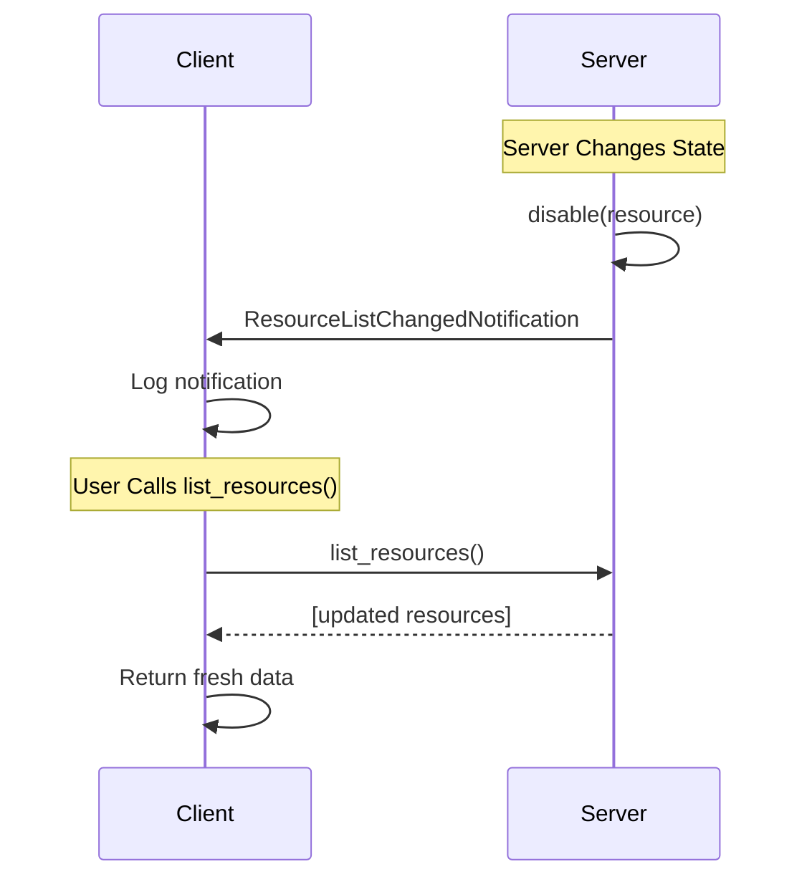

# Resources

Resources in MCP provide structured access to information that AI models need to understand context. They represent data sources that can be retrieved and used by AI applications, such as files, database records, API responses, or any other structured information.

## What are Resources?

Resources are context data sources with:
- **URI-based identification** for consistent addressing
- **Structured access patterns** with defined schemas
- **Multiple content types** (text, JSON, binary data)
- **Dynamic or static content** that can change over time

Common examples include:
- Configuration files and documents
- Database records and query results
- API responses and external data
- Calendar events and schedules
- User preferences and settings

## Types of Resources

### Direct Resources
Static resources with fixed URIs that always return the same type of content.

### Resource Templates
Dynamic resources that accept parameters to generate different content based on input.

## Listing Available Resources

To see what resources are available from a connected MCP server:

<CodeGroup>
```typescript TypeScript
import { MCPClient } from 'mcp-use'

async function listResources() {
    // Initialize client with server configuration
    const config = {
        mcpServers: {
            // Your server definitions here
        }
    }
    const client = new MCPClient(config)

    // Connect to servers
    await client.createAllSessions()

    // Get a session for a specific server
    const session = client.getSession('my_server')

    // List all available resources - always returns fresh data
    const resources = await session.listResources()

    for (const resource of resources) {
        console.log(`Resource: ${resource.name}`)
        console.log(`URI: ${resource.uri}`)
        console.log(`Description: ${resource.description}`)
        console.log(`MIME Type: ${resource.mimeType}`)
        console.log('---')
    }

    await client.closeAllSessions()
}

// Run the example
listResources().catch(console.error)
```

```typescript TypeScript
import { MCPClient } from 'mcp-use'

async function listResources() {
    // Initialize client with server configuration
    const config = {
        mcpServers: {
            // Your server definitions here
        }
    }
    const client = new MCPClient(config)

    // Connect to servers
    await client.createAllSessions()

    // Get a session for a specific server
    const session = client.getSession('my_server')

    // List all available resources - always returns fresh data
    const resources = await session.listResources()

    for (const resource of resources) {
        console.log(`Resource: ${resource.name}`)
        console.log(`URI: ${resource.uri}`)
        console.log(`Description: ${resource.description}`)
        console.log(`MIME Type: ${resource.mimeType}`)
        console.log('---')
    }

    await client.closeAllSessions()
}

// Run the example
listResources().catch(console.error)
```
</CodeGroup>

### Automatic Resource List Update

When servers send `ResourceListChangedNotification`, it signals that the resource list has changed. The `list_resources()` method always fetches fresh data from the server, ensuring you get up-to-date information.



**Important:** Always use `await session.list_resources()` instead of the deprecated `session.resources` property to ensure you get fresh data:

<CodeGroup>
```typescript TypeScript
// ✅ Recommended - always returns fresh data
const resources = await session.listResources()

// ⚠️ Deprecated - may return stale data
// const resources = session.resources
```

```typescript TypeScript
// ✅ Recommended - always returns fresh data
const resources = await session.listResources()

// ⚠️ Deprecated - may return stale data
// const resources = session.resources
```
</CodeGroup>

## Reading Resources

Resources are accessed using the `read_resource` method with their URI:

<CodeGroup>
```typescript TypeScript
import { MCPClient } from 'mcp-use'

async function readResourceExample() {
    const config = {
        mcpServers: {
            // Your server definitions here
        }
    }
    const client = new MCPClient(config)
    await client.createAllSessions()

    const session = client.getSession('file_server')

    // Read a resource by URI
    const resourceUri = 'file:///path/to/config.json'
    const result = await session.readResource(resourceUri)

    // Handle the result
    for (const content of result.contents) {
        if (content.mimeType === 'application/json') {
            console.log(`JSON content: ${content.text}`)
        } else if (content.mimeType === 'text/plain') {
            console.log(`Text content: ${content.text}`)
        } else {
            console.log(`Binary content length: ${content.blob?.length}`)
        }
    }

    await client.closeAllSessions()
}

readResourceExample().catch(console.error)
```

```typescript TypeScript
import { MCPClient } from 'mcp-use'

async function readResourceExample() {
    const config = {
        mcpServers: {
            // Your server definitions here
        }
    }
    const client = new MCPClient(config)
    await client.createAllSessions()

    const session = client.getSession('file_server')

    // Read a resource by URI
    const resourceUri = 'file:///path/to/config.json'
    const result = await session.readResource(resourceUri)

    // Handle the result
    for (const content of result.contents) {
        if (content.mimeType === 'application/json') {
            console.log(`JSON content: ${content.text}`)
        } else if (content.mimeType === 'text/plain') {
            console.log(`Text content: ${content.text}`)
        } else {
            console.log(`Binary content length: ${content.blob?.length}`)
        }
    }

    await client.closeAllSessions()
}

readResourceExample().catch(console.error)
```
</CodeGroup>

## Working with Resource Templates

Resource templates allow dynamic content generation based on parameters:

<CodeGroup>
```typescript TypeScript
import { MCPClient } from 'mcp-use'

async function templateResourceExample() {
    const config = {
        mcpServers: {
            // Your server definitions here
        }
    }
    const client = new MCPClient(config)
    await client.createAllSessions()

    const session = client.getSession('database_server')

    // Access a parameterized resource
    // Template URI might be: "db://users/{user_id}/profile"
    const resourceUri = 'db://users/12345/profile'
    const result = await session.readResource(resourceUri)

    // Process the user profile data
    for (const content of result.contents) {
        console.log(`User profile: ${content.text}`)
    }

    await client.closeAllSessions()
}

templateResourceExample().catch(console.error)
```

```typescript TypeScript
import { MCPClient } from 'mcp-use'

async function templateResourceExample() {
    const config = {
        mcpServers: {
            // Your server definitions here
        }
    }
    const client = new MCPClient(config)
    await client.createAllSessions()

    const session = client.getSession('database_server')

    // Access a parameterized resource
    // Template URI might be: "db://users/{user_id}/profile"
    const resourceUri = 'db://users/12345/profile'
    const result = await session.readResource(resourceUri)

    // Process the user profile data
    for (const content of result.contents) {
        console.log(`User profile: ${content.text}`)
    }

    await client.closeAllSessions()
}

templateResourceExample().catch(console.error)
```
</CodeGroup>

## Resource Content Types

Resources can contain different types of content:

### Text Content

<CodeGroup>
```typescript TypeScript
// Text-based resources (JSON, XML, plain text)
const result = await session.readResource('file:///config.json')

for (const content of result.contents) {
    if ('text' in content) {
        console.log(`Text content: ${content.text}`)
        console.log(`MIME type: ${content.mimeType}`)
    }
}
```

```typescript TypeScript
// Text-based resources (JSON, XML, plain text)
const result = await session.readResource('file:///config.json')

for (const content of result.contents) {
    if ('text' in content) {
        console.log(`Text content: ${content.text}`)
        console.log(`MIME type: ${content.mimeType}`)
    }
}
```
</CodeGroup>

### Binary Content

<CodeGroup>
```typescript TypeScript
import { writeFileSync } from 'fs'

// Binary resources (images, files, etc.)
const result = await session.readResource('file:///image.png')

for (const content of result.contents) {
    if ('blob' in content && content.blob) {
        console.log(`Binary data size: ${content.blob.length} bytes`)
        // Save or process binary data
        writeFileSync('downloaded_image.png', Buffer.from(content.blob))
    }
}
```

```typescript TypeScript
import { writeFileSync } from 'fs'

// Binary resources (images, files, etc.)
const result = await session.readResource('file:///image.png')

for (const content of result.contents) {
    if ('blob' in content && content.blob) {
        console.log(`Binary data size: ${content.blob.length} bytes`)
        // Save or process binary data
        writeFileSync('downloaded_image.png', Buffer.from(content.blob))
    }
}
```
</CodeGroup>

## Resource Discovery

Find resources matching specific criteria:

<CodeGroup>
```typescript TypeScript
async function findResources() {
    const session = client.getSession('my_server')
    const resources = await session.listResources()

    // Find JSON configuration files
    const configResources = resources.filter(
        r => r.mimeType === 'application/json'
            && r.name.toLowerCase().includes('config')
    )

    for (const resource of configResources) {
        console.log(`Found config: ${resource.name} at ${resource.uri}`)
    }
}
```

```typescript TypeScript
async function findResources() {
    const session = client.getSession('my_server')
    const resources = await session.listResources()

    // Find JSON configuration files
    const configResources = resources.filter(
        r => r.mimeType === 'application/json'
            && r.name.toLowerCase().includes('config')
    )

    for (const resource of configResources) {
        console.log(`Found config: ${resource.name} at ${resource.uri}`)
    }
}
```
</CodeGroup>

## Error Handling

Always handle potential errors when reading resources:

<CodeGroup>
```typescript TypeScript
try {
    const result = await session.readResource('file:///missing.txt')
    for (const content of result.contents) {
        console.log(`Content: ${content.text}`)
    }
} catch (error) {
    console.error(`Failed to read resource: ${error}`)
}
```

```typescript TypeScript
try {
    const result = await session.readResource('file:///missing.txt')
    for (const content of result.contents) {
        console.log(`Content: ${content.text}`)
    }
} catch (error) {
    console.error(`Failed to read resource: ${error}`)
}
```
</CodeGroup>
