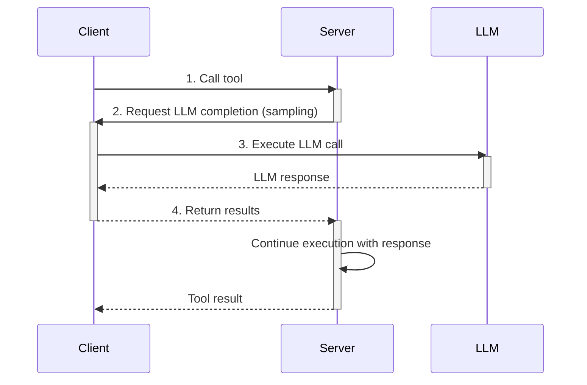

Sampling enables MCP tools to request LLM completions during their execution. This powerful feature allows servers to dynamically generate content, make decisions, or process data using AI models while executing tool calls.

<Info>
  **What is Sampling?** Sampling is when an MCP server calls back to the client
  requesting an LLM completion. This enables tools to leverage AI capabilities
  without directly integrating with LLM providers.
</Info>

## Understanding Sampling

Sampling creates a callback mechanism where:

1. Client calls a tool on the server
2. Server requests an LLM completion from the client
3. Client executes the LLM call and returns results
4. Server continues execution with the LLM response



This pattern is useful for:

- Content generation within tools
- Dynamic decision making
- Data transformation and analysis
- Interactive workflows

## Configuration

To enable sampling, provide an `onSampling` function when initializing the MCPClient:

<Info>
  **Deprecated:** The `samplingCallback` name is still supported for backward
  compatibility but will be removed in a future version. Use `onSampling`
  instead.
</Info>

<CodeGroup>
```typescript TypeScript
import { MCPClient } from 'mcp-use'
import type { CreateMessageRequestParams, CreateMessageResult } from 'mcp-use'

async function onSampling(
params: CreateMessageRequestParams
): Promise<CreateMessageResult> {
// Integrate with your LLM of choice (OpenAI, Anthropic, etc.)
// Extract the last message content
const lastMessage = params.messages[params.messages.length - 1]
const content = Array.isArray(lastMessage.content)
? lastMessage.content[0]
: lastMessage.content

// Call your LLM with optional parameters
const response = await yourLlm.complete({
text: content.text,
systemPrompt: params.systemPrompt,
maxTokens: params.maxTokens,
temperature: params.temperature,
stopSequences: params.stopSequences,
})

return {
role: 'assistant',
content: { type: 'text', text: response },
model: 'your-model-name',
stopReason: 'endTurn'
}
}

const client = new MCPClient(config, {
onSampling
})

````

</CodeGroup>

## Type Definitions

### CreateMessageRequestParams

The params object passed to your sampling callback includes:

```typescript
interface CreateMessageRequestParams {
  messages: Array<{
    role: 'user' | 'assistant';
    content: {
      type: 'text' | 'image';
      text?: string;
      data?: string;
      mimeType?: string;
    };
  }>;

  // Optional model preferences
  modelPreferences?: {
    hints?: Array<{ name?: string }>;
    costPriority?: number;       // 0.0 to 1.0
    speedPriority?: number;       // 0.0 to 1.0
    intelligencePriority?: number; // 0.0 to 1.0
  };

  // Optional parameters
  systemPrompt?: string;
  maxTokens?: number;
  temperature?: number;
  stopSequences?: string[];
  includeContext?: 'none' | 'thisServer' | 'allServers';
  metadata?: Record<string, unknown>;
}
````

### CreateMessageResult

Your callback must return this structure:

```typescript
interface CreateMessageResult {
  role: "assistant";
  content: {
    type: "text" | "image";
    text?: string; // For text content
    data?: string; // For image content (base64)
    mimeType?: string; // For image content
  };
  model: string;
  stopReason?: "endTurn" | "maxTokens" | "stopSequence";
}
```

### Example with Model Preferences

```typescript
async function onSampling(
  params: CreateMessageRequestParams
): Promise<CreateMessageResult> {
  // Handle model preferences if provided
  let modelName = "default-model";

  if (params.modelPreferences?.hints?.[0]?.name) {
    modelName = params.modelPreferences.hints[0].name;
  } else if (params.modelPreferences?.intelligencePriority > 0.8) {
    modelName = "gpt-4";
  } else if (params.modelPreferences?.speedPriority > 0.8) {
    modelName = "gpt-3.5-turbo";
  }

  const lastMessage = params.messages[params.messages.length - 1];
  const content = Array.isArray(lastMessage.content)
    ? lastMessage.content[0]
    : lastMessage.content;

  const response = await yourLlm.complete({
    model: modelName,
    text: content.text,
    systemPrompt: params.systemPrompt,
    maxTokens: params.maxTokens,
    temperature: params.temperature,
  });

  return {
    role: "assistant",
    content: { type: "text", text: response },
    model: modelName,
    stopReason: "endTurn",
  };
}
```

<Tip>
  To check how to create sampling-enabled tools, see the [Server Tools
  Guide](../server/sampling).
</Tip>
