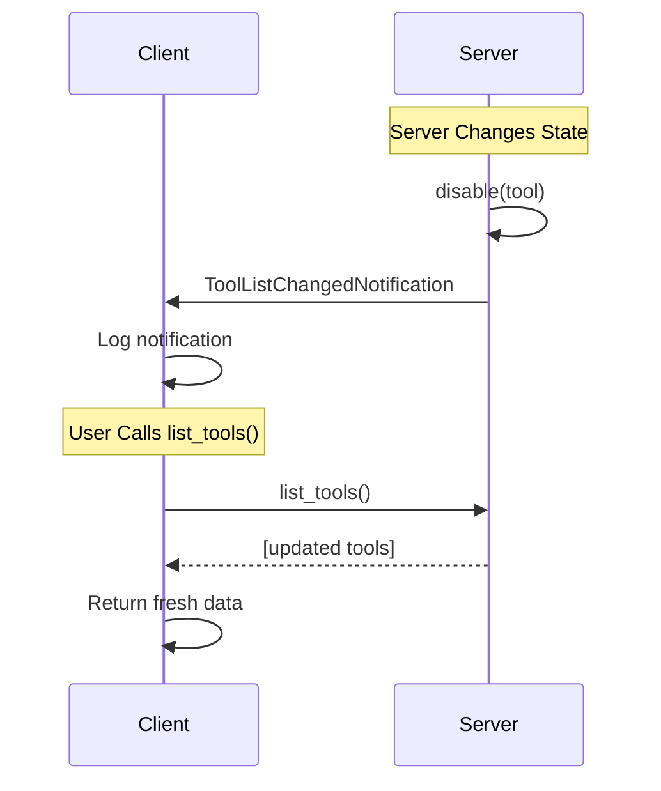

# Tools

Tools in MCP are server-implemented functions that enable AI models to perform specific actions. They represent capabilities that a server exposes to clients, allowing AI applications to interact with external systems, execute commands, or manipulate data.

## What are Tools?

Tools are well-defined functions with:
- **JSON Schema definitions** that specify their inputs and outputs
- **Single, focused operations** that perform one specific task
- **User approval requirement** before execution for security

Common examples include:
- File operations (read, write, delete)
- Web browsing and data fetching
- Database queries
- API calls to external services
- System commands

## Listing Available Tools

To see what tools are available from a connected MCP server:

<CodeGroup>
```typescript TypeScript
import { MCPClient } from 'mcp-use'

async function listTools() {
    // Initialize client with server configuration
    const config = {
        mcpServers: {
            // Your server definitions here
        }
    }
    const client = new MCPClient(config)

    // Connect to servers
    await client.createAllSessions()

    // Get a session for a specific server
    const session = client.getSession('my_server')

    // List all available tools - always returns fresh data
    const tools = await session.listTools()

    for (const tool of tools) {
        console.log(`Tool: ${tool.name}`)
        console.log(`Description: ${tool.description}`)
        console.log(`Schema: ${JSON.stringify(tool.inputSchema)}`)
        console.log('---')
    }

    await client.closeAllSessions()
}

// Run the example
listTools().catch(console.error)
```

```typescript TypeScript
import { MCPClient } from 'mcp-use'

async function listTools() {
    // Initialize client with server configuration
    const config = {
        mcpServers: {
            // Your server definitions here
        }
    }
    const client = new MCPClient(config)

    // Connect to servers
    await client.createAllSessions()

    // Get a session for a specific server
    const session = client.getSession('my_server')

    // List all available tools - always returns fresh data
    const tools = await session.listTools()

    for (const tool of tools) {
        console.log(`Tool: ${tool.name}`)
        console.log(`Description: ${tool.description}`)
        console.log(`Schema: ${JSON.stringify(tool.inputSchema)}`)
        console.log('---')
    }

    await client.closeAllSessions()
}

// Run the example
listTools().catch(console.error)
```
</CodeGroup>

### Automatic Tool List Update

When servers send `ToolListChangedNotification`, it signals that the tool list has changed. The `list_tools()` method always fetches fresh data from the server, ensuring you get up-to-date information.



**Important:** Always use `await session.list_tools()` instead of the deprecated `session.tools` property to ensure you get fresh data:

<CodeGroup>
```typescript TypeScript
// ✅ Recommended - always returns fresh data
const tools = await session.listTools()

// ⚠️ Deprecated - may return stale data
// const tools = session.tools
```

```typescript TypeScript
// ✅ Recommended - always returns fresh data
const tools = await session.listTools()

// ⚠️ Deprecated - may return stale data
// const tools = session.tools
```
</CodeGroup>

## Calling Tools

Tools are executed using the `call_tool` method:

<CodeGroup>
```typescript TypeScript
import { MCPClient } from 'mcp-use'

async function callToolExample() {
    const config = {
        mcpServers: {
            // Your server definitions here
        }
    }
    const client = new MCPClient(config)
    await client.createAllSessions()

    const session = client.getSession('filesystem_server')

    // Call a tool with arguments
    const result = await session.callTool(
        'read_file',
        {
            path: '/path/to/file.txt',
            encoding: 'utf-8'
        }
    )

    // Handle the result
    if (result.isError) {
        console.error(`Error: ${result.content}`)
    } else {
        console.log(`File content: ${result.content}`)
    }

    await client.closeAllSessions()
}

callToolExample().catch(console.error)
```

```typescript TypeScript
import { MCPClient } from 'mcp-use'

async function callToolExample() {
    const config = {
        mcpServers: {
            // Your server definitions here
        }
    }
    const client = new MCPClient(config)
    await client.createAllSessions()

    const session = client.getSession('filesystem_server')

    // Call a tool with arguments
    const result = await session.callTool(
        'read_file',
        {
            path: '/path/to/file.txt',
            encoding: 'utf-8'
        }
    )

    // Handle the result
    if (result.isError) {
        console.error(`Error: ${result.content}`)
    } else {
        console.log(`File content: ${result.content}`)
    }

    await client.closeAllSessions()
}

callToolExample().catch(console.error)
```
</CodeGroup>

## Timeout Configuration

The MCP SDK uses a default timeout of 60 seconds for tool calls. For long-running operations, you can configure custom timeout settings:

<CodeGroup>
```typescript TypeScript
// Tool call with extended timeout
const result = await session.callTool('long_running_task', { data: '...' }, {
    timeout: 300000, // 5 minutes
})
```

```typescript TypeScript
// Tool call with progress-based timeout reset
// This allows the timeout to reset whenever the server sends a progress notification
const result = await session.callTool('sampling_task', { prompt: '...' }, {
    timeout: 60000, // 1 minute initial timeout
    resetTimeoutOnProgress: true // Reset timeout when progress is received
})
```
</CodeGroup>

Available options:
- **`timeout`**: Request timeout in milliseconds (default: 60000)
- **`maxTotalTimeout`**: Maximum total time in milliseconds, even with progress resets
- **`resetTimeoutOnProgress`**: If true, resets the timeout counter when a progress notification is received (default: false)
- **`signal`**: An `AbortSignal` to programmatically cancel the request

## Tool Results

Tool calls return a `CallToolResult` object with:
- `content`: The result data or error message
- `isError`: Boolean indicating success or failure
- Additional metadata about the execution

<CodeGroup>
```typescript TypeScript
// Example of handling tool results
const result = await session.callTool('search_web', { query: 'MCP protocol' })

if (result.isError) {
    console.error(`Tool execution failed: ${result.content}`)
} else {
    // Process successful result
    for (const item of result.content) {
        console.log(`Found: ${item}`)
    }
}
```

```typescript TypeScript
// Example of handling tool results
const result = await session.callTool('search_web', { query: 'MCP protocol' })

if (result.isError) {
    console.error(`Tool execution failed: ${result.content}`)
} else {
    // Process successful result
    for (const item of result.content) {
        console.log(`Found: ${item}`)
    }
}
```
</CodeGroup>

## Error Handling

Always handle potential errors when calling tools:

<CodeGroup>
```typescript TypeScript
try {
    const result = await session.callTool('risky_operation', { param: 'value' })
    if (result.isError) {
        console.error(`Tool reported error: ${result.content}`)
    } else {
        console.log(`Success: ${result.content}`)
    }
} catch (error) {
    console.error(`Connection or protocol error: ${error}`)
}
```

```typescript TypeScript
try {
    const result = await session.callTool('risky_operation', { param: 'value' })
    if (result.isError) {
        console.error(`Tool reported error: ${result.content}`)
    } else {
        console.log(`Success: ${result.content}`)
    }
} catch (error) {
    console.error(`Connection or protocol error: ${error}`)
}
```
</CodeGroup>
