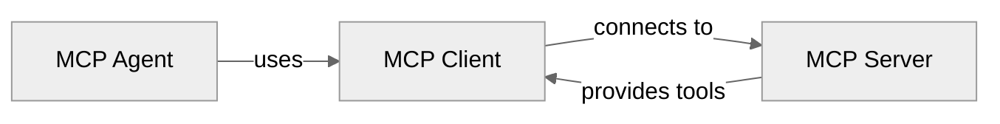

**mcp-use** is a unified MCP framework to build **MCP servers**, **MCP clients** and **MCP Agents**.




| Section | Description | |
|---------|-------------|---------|
| [Agent](#mcp-agent) | An AI Agent with tool calling capabilities through MCP connections | [Examples](https://github.com/mcp-use/mcp-use/tree/main/libraries/typescript/packages/mcp-use/examples/agent) |
| [Client](#mcp-client) | A full featured MCP Client implementation for TypeScript with node, browser and react support | [Examples](https://github.com/mcp-use/mcp-use/tree/main/examples/client) |
| [Server](#mcp-server) | The MCP Server framework implementation for TypeScript, with Apps SDK and MCP-UI support | [Examples](https://github.com/mcp-use/mcp-use/tree/main/examples/server) |


## MCP Agent

**mcp-use** has a complete MCP Agent implementation for TypeScript.
**MCP Agents** are AI-powered agents that can use tools from MCP servers to accomplish complex tasks. They reason across multiple steps, selecting and executing tools as needed.
Building such agents is easy with **mcp-use**, all you need is an LLM and the MCP Client.

<CodeGroup>
```bash yarn
yarn add mcp-use
```
```bash npm
npm install mcp-use
```
```bash pnpm
pnpm add mcp-use
```
</CodeGroup>

Here's a simple example to get you started for an agent with **browser tools** support.

```typescript TypeScript
import { ChatOpenAI } from '@langchain/openai' // use your preferred LLM provider
import { MCPAgent, MCPClient } from 'mcp-use'
// Create MCPClient from configuration object
const client = new MCPClient({
  mcpServers: {
    playwright: {
      command: 'npx',
      args: ['@playwright/mcp@latest'],
      env: {
        DISPLAY: ':1'
      }
    }
  }
})

// Create agent with the client
const agent = new MCPAgent({
  llm: new ChatOpenAI({ model: 'gpt-5.1' }), // use your preferred LLM provider
  client,
  maxSteps: 30
})

// Run the query
const result = await agent.run(
    'Find the best restaurant in San Francisco USING GOOGLE SEARCH'
)
console.log(`\nResult: ${result}`)

// Clean up
await client.closeAllSessions()

```

<Tip>
For multi-server setups, tool restrictions, and advanced configuration options, see the [Agent Configuration](/typescript/agent/agent-configuration) and [Client Configuration](/typescript/client/client-configuration) guides.
</Tip>

For a complete overview of the mcp-use MCP Agent, see the [MCP Agent](/typescript/agent) documentation.


### Available MCP Servers

mcp-use supports **any MCP server**. Check out the [Awesome MCP Servers](https://github.com/punkpeye/awesome-mcp-servers) list for available options.
Or deploy your own following the instruction [below](#mcp-server).


## MCP Client
**mcp-use** has a complete MCP Client implementation for TypeScript.
It improves the official Model Context Protocol Client SDK with browser and server environments support, react hooks and more.
The mcp-use client has a conformance score of 100/100 based on the official MCP Conformance Tests.

<CodeGroup>
```bash yarn
yarn add mcp-use
```
```bash npm
npm install mcp-use
```
```bash pnpm
pnpm add mcp-use
```
</CodeGroup>

Then create a new MCP Client:

<CodeGroup>
```typescript TypeScript
import { MCPClient } from 'mcp-use'

const client = new MCPClient({
    mcpServers: {
        everything: {
            command: 'npx',
            args: ['-y', '@modelcontextprotocol/server-everything']
        }
    }
})

// Initialize all configured sessions
await client.createAllSessions()

// Get the session for a specific server
const session = client.getSession('everything')

// List available tools
const tools = await session.listTools()
console.log(`Available tools: ${tools.map(t => t.name).join(', ')}`)

// Call a specific tool with arguments
const result = await session.callTool(
    'add',
    { a: 1, b: 2 }
)
```

```typescript React
import { useMcp } from 'mcp-use/react'

const { tools, callTool } = useMcp({
    url: 'http://localhost:3000/mcp'
})

const result = await callTool('add', { a: 1, b: 2 })
```

</CodeGroup>

To learn more about the MCP Client, see the [MCP Client](/typescript/client) documentation.

## MCP Server
**mcp-use** has a complete MCP server framework implementation for TypeScript. 
It improves the official Model Context Protocol SDK with support for Edge Runtime, ChatGPT Apps SDK and MCP-UI. In addition, it supports all official MCP features and achieves a conformance score of 100/100 based on the official MCP Conformance Tests.

```bash
npx create-mcp-use-app my-mcp-server
cd my-mcp-server
npm run dev
```


This command will create a new MCP server with:
- A complete TypeScript MCP server project structure.
- Example MCP Tools and Resources to get you started.
- Example UI Widgets React components in `resources/` folder exposed as tools and resources in Apps SDK for ChatGPT and MCP-UI format.
- Automatically launches an MCP Inspector in your browser to test your server.

### Project Structure

After creation, your project will have this structure:

```
my-mcp-server/
├── resources/
│   └── component.tsx  # React widgets for Apps SDK and MCP-UI
├── index.ts           # MCP server entry point, you can add tools and rest endpoints here
├── package.json
├── tsconfig.json
└── README.md
```

### Running Your MCP Server

Commands:

<CodeGroup>
```bash yarn
yarn dev   # start the development server
yarn build # build the server
yarn start # start the production server
yarn deploy # deploy the server to mcp-use cloud
```
```bash npm
npm run dev   # start the development server
npm run build # build the server
npm run start # start the production server
npm run deploy # deploy the server to mcp-use cloud
```
```bash pnpm
pnpm dev   # start the development server
pnpm build # build the server
pnpm start # start the production server
pnpm deploy # deploy the server to mcp-use cloud
```
</CodeGroup>

When you run your MCP server, it will be available at:
- **MCP Endpoint**: `http://localhost:3000/mcp` - For MCP client connections
- **MCP Inspector**: `http://localhost:3000/inspector` 


### Deploy Your MCP Server
You can deploy your MCP server on any platform. Build your MCP server with `npm run build` and start the production server with `npm run start`.
Or you can deploy it on [mcp-use Cloud](https://mcp-use.com).
For detailed instructions, see the [Deploy Your Server](/typescript/server/deployment/mcp-use) guide.


### Next Steps

- [Core features](/typescript/server/tools): Learn how to create MCP tools, prompts and resources.
- [UI Widgets](/typescript/server/ui-widgets): Expose UI components to chat clients compatible with ChatGPT Apps SDK and MCP-UI.
- [Configuration](/typescript/server/configuration): Advanced configuration and deployment options.
- [Deploy Your Server](/typescript/server/deployment/mcp-use) - Deploy to production with one command

---


## Next Steps

<CardGroup cols={3}>
  <Card title="Agent Configuration" icon="cog" href="/typescript/agent/agent-configuration">
    Configure your Agent and connected MCP servers
  </Card>
  <Card title="UI Widgets" icon="app-window-mac" href="/typescript/server/ui-widgets">
    Create your own UI widgets for ChatGPT Apps SDK and MCP-UI.
  </Card>
  <Card title="Deployment" icon="cloud" href="/typescript/server/deployment/mcp-use">
    Deploy your MCP server to production with one command.
  </Card>
</CardGroup>

<Tip>
**Need Help?** Join our [Discord](https://discord.gg/XkNkSkMz3V) or [Github](https://github.com/mcp-use/mcp-use) communities.
</Tip>
