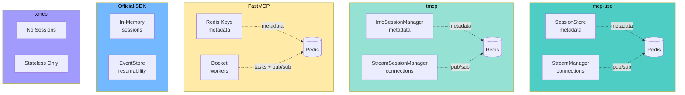

This document compares mcp-use's session management architecture with other popular MCP server implementations.

## Quick Comparison

| Feature | mcp-use | tmcp | FastMCP | Official SDK | xmcp |
|---------|---------|------|---------|--------------|------|
| **Language** | TypeScript | JavaScript | Python | TypeScript | TypeScript |
| **Stateful Mode** | ✅ | ✅ | ✅ | ✅ | ❌ |
| **Stateless Mode** | ✅ | ❌ | ✅ | ✅ | ✅ |
| **Split Architecture** | ✅ | ✅ | ✅ | ❌ | N/A |
| **Redis Session Storage** | ✅ | ✅ | ✅ | ❌ | N/A |
| **Redis Stream Pub/Sub** | ✅ | ✅ | ✅ | ❌ | N/A |
| **PostgreSQL Storage** | ❌ | ✅ | ❌ | ❌ | N/A |
| **Cloudflare Durable Objects** | ❌ | ✅ | ❌ | ❌ | N/A |
| **Distributed Notifications** | ✅ | ✅ | ✅ | ❌ | N/A |
| **Registration Replay** | ✅ | ❌ | ❌ | ❌ | ❌ |
| **Auto Runtime Detection** | ✅ | ❌ | ❌ | ❌ | ❌ |

## Detailed Comparison

### 1. mcp-use (This Library)

**Architecture:**
- Split: `SessionStore` (metadata) + `StreamManager` (connections)
- Registration replay pattern for DX
- Auto-detection of stateless/stateful based on runtime (Deno vs Node.js)

**Implementations:**
- `InMemorySessionStore` + `InMemoryStreamManager` (default)
- `RedisSessionStore` + `RedisStreamManager` (distributed)

**Unique Features:**
- **Registration Replay**: Register tools/prompts/resources once, automatically replayed per session
- **Auto Runtime Detection**: Deno → stateless, Node.js → stateful (configurable)
- **Unified DX**: Single `MCPServer` class works in all modes

**Example:**
```typescript
const server = new MCPServer({
  name: 'my-server',
  version: '1.0.0',
  sessionStore: new RedisSessionStore({ client: redis }),
  streamManager: new RedisStreamManager({ client: redis, pubSubClient: pubSubRedis })
});

// Register once
server.tool('greet', { name: z.string() }, async ({ name }) => {
  return `Hello, ${name}!`;
});

// Automatically replayed for each new session
```

### 2. tmcp

**Architecture:**
- Split: `InfoSessionManager` (metadata) + `StreamSessionManager` (connections)
- Most pluggable architecture (4 storage backends)

**Implementations:**
- In-memory (default)
- Redis Pub/Sub
- PostgreSQL LISTEN/NOTIFY
- Cloudflare Durable Objects + KV

**Unique Features:**
- **Most Storage Options**: 4 different backends out of the box
- **Cloudflare Native**: First-class Durable Objects support
- **Fully Pluggable**: Abstract interfaces for everything

**Example:**
```javascript
import { HttpTransport } from '@tmcp/transport-http';
import { RedisStreamSessionManager, RedisInfoSessionManager } from '@tmcp/session-manager-redis';

const transport = new HttpTransport(server, {
  sessionManager: {
    streams: new RedisStreamSessionManager(redisUrl),
    info: new RedisInfoSessionManager(redisUrl)
  }
});
```

### 3. FastMCP (Python)

**Architecture:**
- Uses **Docket** (distributed task queue) for background execution
- Redis Pub/Sub for notifications
- Celery-like worker model

**Implementation:**
- Redis-only (tightly coupled with Docket)

**Unique Features:**
- **Background Tasks**: Long-running tool executions via Docket
- **Task Status Notifications**: Real-time progress updates
- **Python Ecosystem**: FastAPI integration, Pydantic schemas

**Example:**
```python
from fastmcp import FastMCP

app = FastMCP(
    "my-server",
    stateless_http=False  # Enable sessions
)

@app.tool()
async def long_running_task():
    # Runs in background Docket worker
    await asyncio.sleep(60)
    return "Done!"
```

### 4. Official SDK (@modelcontextprotocol/sdk)

**Architecture:**
- Single `McpServer` instance per session
- `EventStore` for SSE resumability
- No built-in distributed support

**Implementation:**
- In-memory only
- `InMemoryEventStore` for resumability

**Unique Features:**
- **Reference Implementation**: Follows spec exactly
- **EventStore**: SSE resumability (client can reconnect and resume)
- **Spec Compliance**: Most conservative, spec-focused

**Example:**
```typescript
const server = new McpServer({ name: 'my-server', version: '1.0.0' });

server.registerTool('greet', { name: 'string' }, async ({ name }) => {
  return { content: [{ type: 'text', text: `Hello, ${name}!` }] };
});

// Must register for EACH session - no replay
```

### 5. xmcp

**Architecture:**
- Strictly stateless
- New server instance per request
- No session management at all

**Implementation:**
- `StatelessStreamableHTTPTransport`

**Unique Features:**
- **Simplest**: No sessions, no state
- **Edge-First**: Designed for Cloudflare Workers
- **Minimal**: Focused on stateless use cases only

**Example:**
```typescript
const transport = new StatelessStreamableHTTPTransport({
  createServerFn: () => createMyServer()
});

// New server created for EVERY request
```

## Key Architectural Differences

### Session Management



### Registration Pattern

| Library | Pattern | DX Impact |
|---------|---------|-----------|
| mcp-use | **Replay** | Register once, auto-replayed per session |
| tmcp | Manual | Register in server setup, shared across sessions |
| FastMCP | Decorator | Use `@tool` decorator, shared across sessions |
| Official SDK | Manual | Must register for each session instance |
| xmcp | Stateless | Register once, new server per request |

### Distributed Capabilities

| Capability | How It Works |
|------------|--------------|
| **tmcp** | Abstract interfaces allow mixing backends (e.g., Redis streams + Postgres metadata) |
| **FastMCP** | Docket provides task queue + Redis Pub/Sub for coordination |
| **mcp-use** | Separate SessionStore + StreamManager with Redis implementations |
| **Official SDK** | Not supported - single instance only |
| **xmcp** | Not applicable - stateless only |

## When to Use Each

### Choose mcp-use If:
- ✅ Want both stateful AND stateless support
- ✅ Need auto runtime detection (Deno/Node.js)
- ✅ Want registration replay for better DX
- ✅ Building distributed TypeScript servers
- ✅ Need full MCP feature support with horizontal scaling

### Choose tmcp If:
- ✅ Need Cloudflare Durable Objects support
- ✅ Want maximum pluggability (4+ storage backends)
- ✅ Building edge-first applications
- ✅ Prefer pure JavaScript (no build step)

### Choose FastMCP If:
- ✅ Using Python
- ✅ Need background task execution
- ✅ Want FastAPI integration
- ✅ Building Celery-like distributed workers

### Choose Official SDK If:
- ✅ Want reference implementation
- ✅ Need EventStore resumability
- ✅ Building single-instance server
- ✅ Prioritize spec compliance over features

### Choose xmcp If:
- ✅ Only need stateless mode
- ✅ Building Cloudflare Workers
- ✅ Want minimal bundle size
- ✅ Don't need notifications/sampling

## Migration Guide

### From Official SDK to mcp-use

```typescript
// Before (Official SDK)
const server = new McpServer({ name: 'my-server', version: '1.0.0' });

server.registerTool('greet', { name: 'string' }, async ({ name }) => {
  return { content: [{ type: 'text', text: `Hello!` }] };
});

// After (mcp-use)
import { MCPServer, text } from 'mcp-use/server';
import { z } from 'zod';

const server = new MCPServer({ name: 'my-server', version: '1.0.0' });

server.tool('greet', { name: z.string() }, async ({ name }) => {
  return text(`Hello, ${name}!`);  // Simpler response helpers
});

// Registration replay: tool registered once, auto-replayed per session
```

### From tmcp to mcp-use

```typescript
// Before (tmcp)
const transport = new HttpTransport(server, {
  sessionManager: {
    streams: new RedisStreamSessionManager(redisUrl),
    info: new RedisInfoSessionManager(redisUrl)
  }
});

// After (mcp-use)
const server = new MCPServer({
  name: 'my-server',
  version: '1.0.0',
  sessionStore: new RedisSessionStore({ client: redis }),
  streamManager: new RedisStreamManager({ client: redis, pubSubClient: pubSubRedis })
});

// More integrated - session/stream management handled automatically
```

## Related Documentation

- [Session Management Guide](/typescript/server/session-management)
- [Server Configuration](/typescript/server/configuration)
- [Deployment Guide](/typescript/server/deployment-mcp-use)

