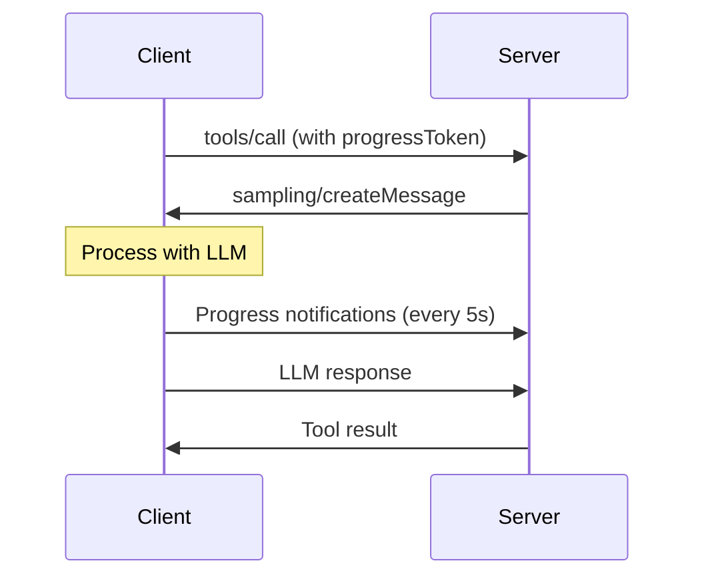

<Info>
Sampling allows MCP server tools to request LLM completions from the client during execution. This enables tools to leverage the client's LLM capabilities for tasks like analysis, decision-making, or text generation.
</Info>

## Overview

When a tool needs an LLM response, it can use `ctx.sample()` to send a request to the client. The client's configured LLM processes the request and returns the result to the tool. This creates powerful workflows where tools can "think" using the client's AI capabilities.

**Key Benefits:**

- **Leverage client's LLM**: Use whatever model the client has configured
- **No server-side LLM**: No need to integrate an LLM provider in your server

## How It Works



## Basic Usage

Use the `sample()` method on the context object within tool callbacks:

```typescript
import { MCPServer, text } from 'mcp-use/server';
import { z } from 'zod';

const server = new MCPServer({
  name: 'my-server',
  version: '1.0.0',
});

server.tool({
  name: 'analyze-sentiment',
  description: 'Analyze sentiment of text using the client\'s LLM',
  schema: z.object({
    text: z.string(),
  })
}, async (params, ctx) => {
  // Simple string API - just pass a prompt!
  const response = await ctx.sample(
    `Analyze the sentiment of the following text as positive, negative, or neutral. 
     Just output a single word. Text: ${params.text}`
  );

  return text(`Sentiment: ${response.content[0].text}`);
});

await server.listen();
```

## API Styles

The `ctx.sample()` method supports two API styles to suit different needs:

### 1. Simplified

Perfect for simple cases where you just need a completion:

```typescript
server.tool({
  name: 'simple-analysis',
  description: 'Analyze text using simplified API',
  schema: z.object({
    text: z.string(),
  })
}, async (params, ctx) => {
  // Just pass a string - that's it!
  const response = await ctx.sample(
    `Summarize this text in one sentence: ${params.text}`
  );
  
  return text(response.content[0].text);
});
```

**With options:**

```typescript
// Add custom options while keeping the simple string API
const response = await ctx.sample(
  `Analyze this: ${params.text}`,
  {
    maxTokens: 50,
    temperature: 0.3,
    timeout: 30000  // 30 seconds
  }
);
```

### 2. Extended

Use when you need fine-grained control over model preferences, system prompts, etc.:

```typescript
server.tool({
  name: 'advanced-analysis',
  description: 'Analyze text with full control',
  schema: z.object({
    text: z.string(),
  })
}, async (params, ctx) => {
  // Full control with complete params object
  const response = await ctx.sample({
    messages: [
      {
        role: 'user',
        content: { 
          type: 'text', 
          text: `Analyze: ${params.text}` 
        },
      },
    ],
    modelPreferences: {
      intelligencePriority: 0.8,  // Prefer smarter models
      speedPriority: 0.5,          // Balance speed
    },
    systemPrompt: 'You are an expert analyst.',
    maxTokens: 100,
  });

  return text(response.content[0].text);
});
```


### Progress reporting

The client will report progress for the generation that can be handled with the `onProgress` callback.

```typescript
server.tool({
  name: 'custom-progress',
  description: 'Custom progress configuration',
  schema: z.object({
    prompt: z.string(),
  })
}, async (params, ctx) => {
  const response = await ctx.sample(
    params.prompt,
    {
      // Limit wait time (default: Infinity)
      timeout: 120000,  // 2 minutes
      
      // Change progress interval (default: 5000ms)
      progressIntervalMs: 2000,
      
      // Custom progress handling
      onProgress: ({ message }) => {
        console.log(`[Progress] ${message}`);
      }
    }
  );
  
  return text(response.content[0].text);
});
```

<Note>
**Default Behavior**: Like `ctx.elicit()`, sampling has no timeout by default and waits indefinitely for the LLM response. This prevents premature failures for complex prompts that may take time to process.
</Note>


## Checking for Sampling Support

You can check if the client supports sampling before attempting to use it:

```typescript
server.tool({
  name: 'conditional-sampling',
  description: 'Use sampling if available',
  schema: z.object({
    text: z.string(),
  })
}, async (params, ctx) => {
  if (!ctx) {
    return text('Context not available - running in stateless mode');
  }

  // Check if client supports sampling
  if (!ctx.client.can('sampling')) {
    return text(`Simple Analysis: ${params.text.length} characters`);
  }

  const response = await ctx.sample(`Analyze: ${params.text}`);
  return text(`LLM Analysis: ${response.content[0].text}`);
});
```

You can also inspect all client capabilities:

```typescript
server.tool({
  name: 'advanced-feature',
  description: 'Uses different features based on client capabilities',
  schema: z.object({ input: z.string() })
}, async (params, ctx) => {
  const caps = ctx.client.capabilities();
  console.log('Client capabilities:', caps);
  // { sampling: {}, roots: { listChanged: true }, elicitation: { form: {}, url: {} } }
  
  if (ctx.client.can('sampling') && ctx.client.can('elicitation')) {
    // Use both sampling and elicitation
    const analysis = await ctx.sample(`Analyze: ${params.input}`);
    return text(`Advanced analysis: ${analysis.content[0].text}`);
  } else if (ctx.client.can('sampling')) {
    // Use only sampling
    const result = await ctx.sample(`Process: ${params.input}`);
    return text(`Result: ${result.content[0].text}`);
  } else {
    // Basic functionality only
    return text(`Basic processing: ${params.input.length} characters`);
  }
});
```

## Example

```typescript
import { MCPServer, text } from 'mcp-use/server';
import { z } from 'zod';

const server = new MCPServer({
  name: 'sentiment-analyzer',
  version: '1.0.0',
});

server.tool({
  name: 'analyze-sentiment',
  description: 'Analyze sentiment using client\'s LLM',
  schema: z.object({
    text: z.string(),
  })
}, async (params, ctx) => {
  const prompt = `Analyze the sentiment of the following text as positive, negative, or neutral.
Just output a single word - 'positive', 'negative', or 'neutral'.

Text to analyze: ${params.text}`;

  const response = await ctx.sample(prompt);
  const sentiment = response.content[0].text.trim().toLowerCase();
  
  return text(`Sentiment: ${sentiment}`);
});

await server.listen();
```


## API Reference

### ctx.sample(prompt: string, options?)

Simplified API 

**Parameters:**
- `prompt` (string): The text prompt to send to the LLM
- `options` (optional):
  - `maxTokens` (number): Maximum tokens in response (default: 1000)
  - `temperature` (number): Sampling temperature 0.0-1.0
  - `timeout` (number): Timeout in milliseconds (default: Infinity)
  - `progressIntervalMs` (number): Progress interval (default: 5000)
  - `onProgress` (function): Custom progress handler

**Returns:** Promise\<CreateMessageResult\>

### ctx.sample(CreateMessageRequestParams, options?)

Extended API 

**Parameters:**
- `params` (object):
  - `messages` (array): Array of message objects
  - `modelPreferences` (optional): Model selection preferences
  - `systemPrompt` (optional): System prompt for the LLM
  - `maxTokens` (optional): Maximum response tokens
- `options` (optional): Same as simplified API

**Returns:** Promise\<CreateMessageResult\>

### CreateMessageResult

```typescript
interface CreateMessageResult {
  role: 'assistant';
  content: Array<{
    type: 'text' | 'image';
    text?: string;
    data?: string;
    mimeType?: string;
  }>;
  model: string;
  stopReason?: 'endTurn' | 'maxTokens' | 'stopSequence';
}
```


## Testing with MCP Inspector

1. Start your server with inspector enabled
2. Navigate to Tools tab
3. Call a tool that uses sampling
4. Approve in the sampling tab
5. Verify the LLM response is processed correctly

## GitHub code

Check out the complete working example with all sampling patterns:

📁 [examples/server/sampling/](https://github.com/mcp-use/mcp-use/tree/main/libraries/typescript/packages/mcp-use/examples/server/sampling)

This example includes:
- Simple string API usage
- Full control API with model preferences
- Custom progress configuration
- All three example tools from this guide

To run the example:

```bash
cd libraries/typescript/packages/mcp-use/examples/server/sampling
pnpm install
pnpm dev
```

Server runs on http://localhost:3000 with MCP Inspector available.

## Next Steps

- [Tools Guide](./tools) - Building executable tools
- [Elicitation](./elicitation) - Request user input during execution
- [Notifications](./notifications) - Send status updates to clients
- [Client Sampling](/typescript/client/sampling) - Configure sampling on the client side

