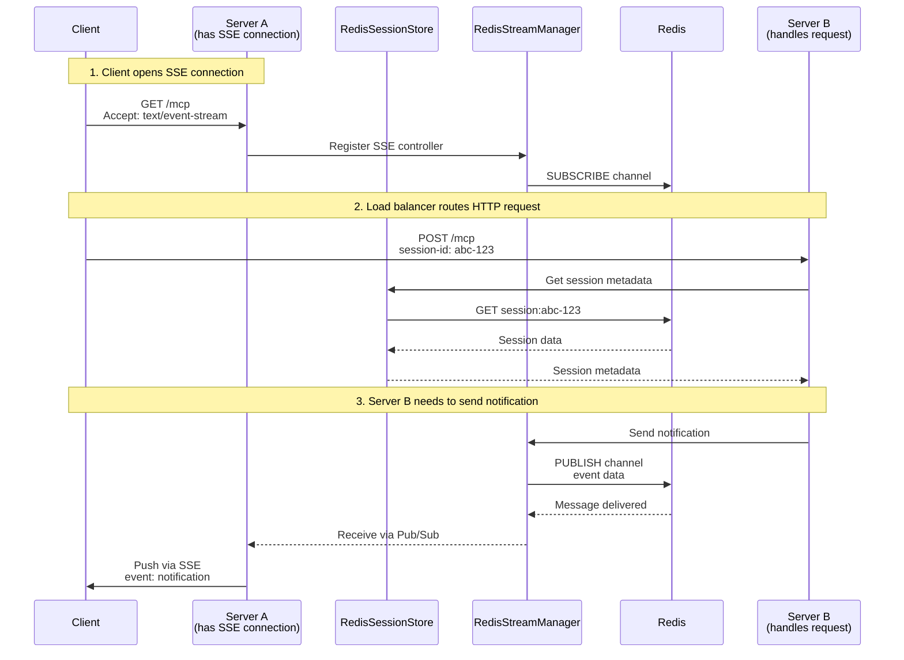

Redis storage consists of two components:

1. **`RedisSessionStore`** - Stores serializable session metadata (capabilities, client info, etc.)
2. **`RedisStreamManager`** - Manages distributed notifications via Redis Pub/Sub

Together, they enable horizontal scaling with full MCP feature support.

## Architecture



## Installation

Install the Redis client library:

```bash
yarn add redis
# or
yarn add ioredis
```

## Basic Setup

### Session Metadata Only

For single-server deployments with persistent sessions:

```typescript
import { MCPServer, RedisSessionStore } from 'mcp-use/server';
import { createClient } from 'redis';

const redis = createClient({
  url: process.env.REDIS_URL,
  password: process.env.REDIS_PASSWORD,
});

await redis.connect();

const sessionStore = new RedisSessionStore({
  client: redis,
  prefix: 'mcp:session:',     // Optional: custom key prefix
  defaultTTL: 3600,            // Optional: 1 hour default TTL (in seconds)
});

const server = new MCPServer({
  name: 'my-server',
  version: '1.0.0',
  sessionStore
});

server.start({ port: 3000 });
```


## Related Documentation

- [Session Management Overview](/typescript/server/session-management)
- [In-Memory Storage](/typescript/server/session-management/memory-storage)
- [File System Storage](/typescript/server/session-management/filesystem-storage)
