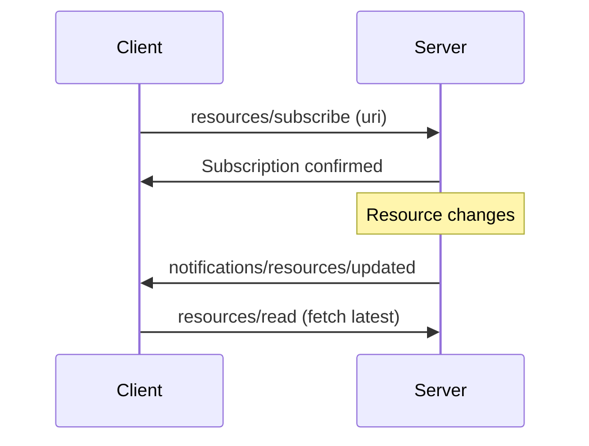

<Info>
Resource subscriptions allow clients to receive automatic notifications when specific resources change. This enables real-time data synchronization without polling.
</Info>

## Overview

Resource subscriptions implement the MCP protocol's `resources/subscribe` and `resources/unsubscribe` methods. When a client subscribes to a resource, your server can notify them whenever that resource is updated.

**Key Features:**

- **Automatic notifications**: Push updates to clients when resources change
- **Session tracking**: Per-session subscription management
- **Automatic cleanup**: Subscriptions are cleaned up when sessions close
- **Efficient**: No polling required - clients receive updates only when resources change

## How It Works



The subscription flow:

1. Client subscribes to a resource URI
2. Server tracks the subscription
3. When the resource changes, server notifies all subscribers
4. Clients can then fetch the updated resource

## Subscribing to Resources

Clients can subscribe to resources to receive automatic notifications when they change. The client API provides subscription methods through the session connector:

```typescript
// Client-side API
import { MCPClient } from 'mcp-use';

const client = new MCPClient(config);
const session = await client.createSession('my-server');

// Subscribe to a resource
await session.connector.subscribeToResource('config://app-settings');

// Listen for update notifications
session.on('notification', (notification) => {
  if (notification.method === 'notifications/resources/updated') {
    console.log('Resource updated:', notification.params.uri);
    // Fetch the updated resource
    const updated = await session.connector.readResource(notification.params.uri);
  }
});

// Later, unsubscribe when no longer needed
await session.connector.unsubscribeFromResource('config://app-settings');
```

The server automatically handles subscription requests and tracks which sessions are subscribed to which resources.

## Notifying Subscribers

When a resource changes, use `server.notifyResourceUpdated()` to notify all subscribed clients:

```typescript
import { MCPServer, object } from 'mcp-use/server';

const server = new MCPServer({
  name: 'config-server',
  version: '1.0.0',
});

// Store configuration state
let appConfig = {
  theme: 'light',
  language: 'en',
  features: ['auth', 'api']
};

// Define the resource
server.resource(
  {
    name: 'app_config',
    uri: 'config://app-settings',
    title: 'Application Configuration',
    description: 'Current application settings'
  },
  async () => object(appConfig)
);

// Update configuration and notify subscribers
server.tool({
  name: 'update-config',
  description: 'Update application configuration',
  schema: z.object({
    theme: z.enum(['light', 'dark']).optional(),
    language: z.string().optional(),
  })
}, async (params) => {
  // Update the configuration
  if (params.theme) appConfig.theme = params.theme;
  if (params.language) appConfig.language = params.language;

  // Notify all subscribed clients
  await server.notifyResourceUpdated('config://app-settings');

  return text('Configuration updated and subscribers notified');
});

await server.listen();
```

## Subscription vs Notifications

Understanding the difference between subscriptions and notifications:

| Feature | Resource Subscriptions | Server Notifications |
|---------|----------------------|----------------------|
| **Purpose** | Track resource changes | Broadcast events |
| **Direction** | Resource-specific | Any custom message |
| **Protocol** | `resources/subscribe`<br/>`resources/updated` | `notifications/*` |
| **Use Case** | Data synchronization | Status updates, events |
| **Client Action** | Must subscribe first | Receives without subscribing |

**Use subscriptions when:**
- Clients need to track specific resource changes
- You want resource-level granularity
- Clients should opt-in to updates

**Use notifications when:**
- Broadcasting general events to all clients
- Sending progress updates or status changes
- One-way messages that don't relate to specific resources

See [Notifications](./notifications) for more details on server notifications.


## Next Steps

- [Resources](./resources) - Learn about creating resources
- [Notifications](./notifications) - Understand server notifications
- [Tools Guide](./tools) - Create tools that update resources
- [MCP Resources Specification](https://modelcontextprotocol.io/specification/2025-06-18/server/resources#subscriptions) - Official protocol details

