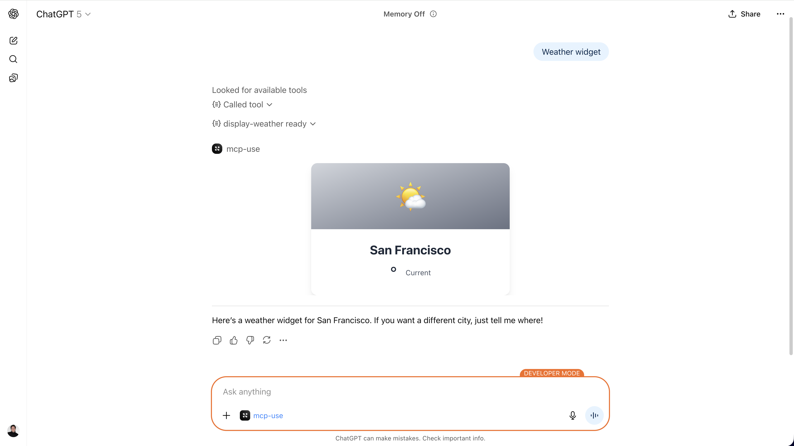
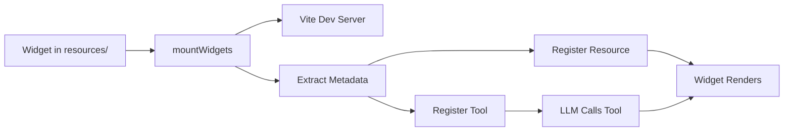

# UI Widgets

UI widgets allow you to create rich, interactive user interfaces that MCP clients can display. 
The framework supports multiple widget formats including **MCP-UI** and **OpenAI Apps SDK** components.





# Automatic Widget Registration

The `mcp-use` framework automatically registers all React components in your `resources/` folder as MCP tools and resources, eliminating the need for manual configuration and boilerplate code. This powerful feature allows you to focus on building UI components while the framework handles the MCP integration.

## Overview

When you create a React component in the `resources/` folder with proper metadata, `mcp-use` automatically:

- **Registers an MCP Tool** - LLMs can invoke it with parameters
- **Registers an MCP Resource** - Clients can discover and access it
- **Extracts Input Schema** - Tool parameters are derived from component props
- **Serves with HMR** - Hot Module Replacement for rapid development
- **Builds for Production** - Optimized Apps SDK widgets
- **Handles Props Mapping** - From LLM → Tool arguments → Apps SDK → React component

**No manual registration required!** Just create a widget file, export metadata, and the mcp-use SDK does the rest.

## Quick Start

### 1. Create a Project

Start with the Apps SDK template which includes automatic widget registration:

```bash
npx create-mcp-use-app my-mcp-server --template apps-sdk
cd my-mcp-server
npm run dev
```

This creates a project with:
```
my-mcp-server/
├── resources/              # 👈 Put your UI widgets here
│   └── display-weather.tsx # Example widget
├── index.ts               # Server entry point
└── package.json
```

### 2. Create a Widget

## Widget Organization

Widgets can be organized in two ways: **single-file widgets** or **folder-based widgets**. Choose the organization style that best fits your widget's complexity.

### Single-File Widgets

For simple widgets, a single file is sufficient:

```
resources/
├── user-card.tsx          # Widget file
├── weather-display.tsx    # Another widget
└── product-card.tsx       # Yet another widget
```

Each `.tsx` file in the `resources/` folder becomes a widget. The widget name is derived from the filename (without extension).

### Folder-Based Widgets

For complex widgets with multiple components, hooks, or utilities, organize them in folders:

```
resources/
├── widget-name.tsx                    # Single-file widget
└── product-search-result/             # Folder-based widget
    ├── widget.tsx                     # Entry point (required)
    ├── components/                    # Sub-components
    │   ├── Accordion.tsx
    │   ├── AccordionItem.tsx
    │   ├── Carousel.tsx
    │   └── CarouselItem.tsx
    ├── hooks/                         # Custom hooks
    │   └── useCarouselAnimation.ts
    ├── constants.ts                   # Constants
    └── types.ts                       # Type definitions
```

**Key Points:**
- The folder name becomes the widget name (e.g., `product-search-result`)
- The entry point must be named `widget.tsx` (not `index.tsx`)
- You can organize sub-components, hooks, utilities, and types within the folder
- The `widget.tsx` file should export `widgetMetadata` and the default component

**Example Folder-Based Widget:**

```tsx
// resources/product-search-result/widget.tsx
import { McpUseProvider, useWidget, type WidgetMetadata } from 'mcp-use/react';
import { Accordion } from './components/Accordion';
import { Carousel } from './components/Carousel';
import type { ProductSearchResultProps } from './types';
import { propSchema } from './types';

export const widgetMetadata: WidgetMetadata = {
  description: 'Display product search results with filtering',
  inputs: propSchema,
};

const ProductSearchResult: React.FC = () => {
  const { props } = useWidget<ProductSearchResultProps>();
  
  return (
    <McpUseProvider autoSize>
      <div>
        <Carousel />
        <Accordion items={props.items} />
      </div>
    </McpUseProvider>
  );
};

export default ProductSearchResult;
```

### When to Use Each Approach

**Use Single-File Widgets When:**
- Widget is simple and self-contained
- No need for sub-components or custom hooks
- Quick prototypes or simple displays

**Use Folder-Based Widgets When:**
- Widget has multiple components
- You need custom hooks or utilities
- Widget is complex and benefits from organization
- You want to share code between components
- Widget needs constants, types, or configuration files

### Widget Name Resolution

- **Single-file**: `user-card.tsx` → widget name: `user-card`
- **Folder-based**: `product-search-result/widget.tsx` → widget name: `product-search-result`

The widget name is used for:
- MCP tool registration (`callTool('product-search-result', {...})`)
- MCP resource URI (`ui://widget/product-search-result`)
- Widget discovery and routing

### 2. Create a Widget

Add a new file in `resources/`, for example `resources/user-card.tsx`:

```tsx
import React from 'react';
import { z } from 'zod';
import { useWidget, type WidgetMetadata } from 'mcp-use/react';

// Define the props schema
const propSchema = z.object({
  name: z.string().describe('User full name'),
  email: z.string().email().describe('User email address'),
  avatar: z.string().url().optional().describe('Avatar image URL'),
  role: z.enum(['admin', 'user', 'guest']).describe('User role'),
});

// Export metadata for automatic registration
export const widgetMetadata: WidgetMetadata = {
  description: 'Display a user profile card',
  inputs: propSchema,
};

type UserCardProps = z.infer<typeof propSchema>;

const UserCard: React.FC = () => {
  // useWidget hook provides props from Apps SDK or MCP-UI
  const { props, theme } = useWidget<UserCardProps>();
  
  const { name, email, avatar, role } = props;
  
  return (
    <div className={`p-6 rounded-lg shadow-lg ${theme === 'dark' ? 'bg-gray-800 text-white' : 'bg-white text-gray-900'}`}>
      {avatar && (
        
      )}
      <h2 className="text-2xl font-bold text-center mb-2">{name}</h2>
      <p className="text-center text-gray-500 mb-2">{email}</p>
      <span className="inline-block px-3 py-1 rounded-full text-sm bg-blue-500 text-white">
        {role}
      </span>
    </div>
  );
};

export default UserCard;
```

### 3. That's It!

The widget is automatically:
- **Registered as tool**: `user-card`
- **Available as resource**: `ui://widget/user-card.html`
- **Ready in ChatGPT**: LLM can call it with name, email, avatar, role

No manual `server.tool()` or `server.uiResource()` calls needed!

## How It Works

### The Flow



### 1. Widget Discovery

When you call `server.listen()`, the framework automatically calls `mountWidgets()` which:

- Scans the `resources/` directory for:
  - **Single-file widgets**: `.tsx` and `.ts` files directly in `resources/`
  - **Folder-based widgets**: Folders containing `widget.tsx` entry point
- Creates a Vite dev server for each widget with HMR support
- Loads widget metadata using Vite SSR
- Widget names are derived from:
  - Filename (without extension) for single-file widgets
  - Folder name for folder-based widgets

**CLI Build Process:**

When using `mcp-use build` or `npm run build`:
- Widgets are discovered using the same logic
- Public folder (`public/`) is automatically copied to `dist/public/`
- Widget metadata is extracted and included in the build manifest
- Production-optimized builds are created for each widget

### 2. Metadata Extraction

The framework looks for the `widgetMetadata` export in each widget file:

```typescript
import type { WidgetMetadata } from 'mcp-use/react';

export const widgetMetadata: WidgetMetadata = {
  description: 'Display weather for a city',
  inputs: propSchema,  // Zod schema for props
}
```

The `inputs` Zod schema defines:
- **What props the component needs**
- **What parameters the tool accepts**
- **Type validation and descriptions for the LLM**

### 3. Tool Registration

The framework automatically registers a tool with:
- **Name**: Derived from filename (single-file) or folder name (folder-based)
  - Single-file: `display-weather.tsx` → `display-weather`
  - Folder-based: `product-search-result/widget.tsx` → `product-search-result`
- **Description**: From `widgetMetadata.description`
- **Inputs**: Converted from Zod schema to MCP input definitions
- **Callback**: Returns the widget resource with a unique URI

### 4. Resource Registration

The framework registers both:
- **Static Resource**: `ui://widget/{name}.html` - Base resource
- **Dynamic Template**: `ui://widget/{name}-{id}.html` - Unique per invocation

Each resource includes:
- **HTML Template**: With proper script tags and styles
- **Apps SDK Metadata**: CSP configuration, widget description, etc.
- **MIME Type**: `text/html+skybridge` for Apps SDK compatibility

### 5. Props Flow

When an LLM invokes the tool:

1. **LLM** fills tool parameters based on context and inputs schema
2. **MCP Server** returns widget resource URI + `structuredContent` with params
3. **Apps SDK** (ChatGPT) loads the widget HTML
4. **Apps SDK** injects params as `window.openai.toolInput`
5. **useWidget Hook** reads from `window.openai` and provides props to React component
6. **React Component** renders with the props


## Widget Metadata 

### widgetMetadata Object
Contains the information that the MCP resource (and the tool that exposes it) will use when are automatically built by mcp-use.
```typescript
import type { WidgetMetadata } from 'mcp-use/react';

export const widgetMetadata: WidgetMetadata = {
  // Required: Human-readable description
  description: string,
  
  // Required: Zod schema defining component props
  inputs: z.ZodObject<...>,
  
  // Optional: Apps SDK metadata (CSP, widget description, etc.)
  appsSdkMetadata?: {
    'openai/widgetDescription'?: string,
    'openai/widgetCSP'?: {
      connect_domains?: string[],
      resource_domains?: string[],
    },
    'openai/toolInvocation/invoking'?: string,
    'openai/toolInvocation/invoked'?: string,
    'openai/widgetAccessible'?: boolean,
    'openai/resultCanProduceWidget'?: boolean,
  },
}
```

### Props Schema with Zod

The `inputs` field uses Zod for:
- **Type Safety**: TypeScript inference for props
- **Runtime Validation**: Ensure correct data types
- **LLM Context**: `.describe()` helps LLM understand what to fill

```typescript
const propSchema = z.object({
  // Basic types
  name: z.string().describe('User name'),
  age: z.number().min(0).max(150).describe('User age'),
  active: z.boolean().describe('Is user active'),
  
  // Enums for specific choices
  status: z.enum(['pending', 'approved', 'rejected']).describe('Request status'),
  
  // Optional fields
  email: z.string().email().optional().describe('Optional email address'),
  
  // Arrays
  tags: z.array(z.string()).describe('List of tags'),
  
  // Nested objects
  address: z.object({
    street: z.string(),
    city: z.string(),
    zip: z.string(),
  }).describe('User address'),
});
```

### Apps SDK Metadata

Configure Apps SDK-specific settings including Content Security Policy (CSP) for external resources:

```typescript
import type { WidgetMetadata } from 'mcp-use/react';

export const widgetMetadata: WidgetMetadata = {
  description: 'Display product search results',
  inputs: propSchema,
  appsSdkMetadata: {
    // Widget description for accessibility
    'openai/widgetDescription': 'Interactive product search with filtering',
    
    // Content Security Policy - define allowed external resources
    'openai/widgetCSP': {
      // API endpoints the widget can connect to
      connect_domains: [
        'https://api.example.com',
        'wss://websocket.example.com'
      ],
      // External resources (scripts, styles, images, fonts)
      resource_domains: [
        'https://cdn.jsdelivr.net',
        'https://unpkg.com',
        'https://fonts.googleapis.com'
      ]
    },
    
    // Tool invocation status messages
    'openai/toolInvocation/invoking': 'Loading products...',
    'openai/toolInvocation/invoked': 'Products loaded',
    
    // Accessibility options
    'openai/widgetAccessible': true,
    'openai/resultCanProduceWidget': true,
  },
};
```

**Note**: The CSP domains you specify will be merged with default trusted domains (like `*.oaistatic.com`, `*.oaiusercontent.com`, `*.openai.com`, and your server's base URL). This ensures your widget can access both your custom resources and OpenAI's required domains.

## The useWidget Hook

The `useWidget` hook is the bridge between Apps SDK and React, providing type-safe access to all widget capabilities:

```typescript
import { useWidget } from 'mcp-use/react';

const MyWidget: React.FC = () => {
  const {
    // Props from LLM/tool invocation
    props,              // Typed props based on your schema
    output,             // Tool output data (structuredContent)
    metadata,           // Response metadata (_meta)
    state,              // Persistent widget state
    setState,           // Update widget state (persists to localStorage)
    
    // Layout & theme
    theme,              // 'light' | 'dark' (auto-syncs with ChatGPT)
    displayMode,        // 'inline' | 'pip' | 'fullscreen'
    safeArea,           // Safe area insets for mobile
    maxHeight,          // Max widget height (pixels)
    userAgent,          // Device capabilities { device, capabilities }
    locale,             // User locale (e.g., 'en-US')
    
    // Actions
    callTool,           // Call other MCP tools from widget
    sendFollowUpMessage,// Send message to ChatGPT conversation
    openExternal,       // Open external URLs in new tab
    requestDisplayMode, // Request display mode change
    
    // Availability
    isAvailable,        // Is window.openai API available
  } = useWidget<MyPropsType, MyOutputType, MyMetadataType, MyStateType>();
  
  return <div>...</div>;
};
```

### Type Parameters

The `useWidget` hook accepts four optional type parameters:

```typescript
useWidget<
  TProps,      // Props type (from toolInput)
  TOutput,     // Output type (from toolOutput/structuredContent)
  TMetadata,    // Metadata type (from toolResponseMetadata)
  TState        // State type (for widgetState)
>()
```

### Helper Hooks

For convenience, there are specialized hooks for common use cases:

```typescript
import { 
  useWidgetProps,   // Just get props
  useWidgetTheme,   // Just get theme
  useWidgetState    // Just get state/setState
} from 'mcp-use/react';

// Get only props
const props = useWidgetProps<{ city: string }>();

// Get only theme
const theme = useWidgetTheme(); // 'light' | 'dark'

// Get state management
const [favorites, setFavorites] = useWidgetState<string[]>([]);
```

### Key Features

**1. Props Without Props**

Components don't accept props via React props. Instead, props come from the hook:

```typescript
// ❌ Don't do this
const MyWidget: React.FC<MyProps> = ({ city, temperature }) => { ... }

// Do this
const MyWidget: React.FC = () => {
  const { props } = useWidget<MyProps>();
  const { city, temperature } = props;
  // ...
}
```

**2. Automatic Provider Detection**

The hook automatically detects whether it's running in:
- **Apps SDK** (ChatGPT): Reads from `window.openai`
- **MCP-UI**: Reads from URL parameters
- **Standalone**: Uses default props

**3. Theme Awareness**

```typescript
const { theme } = useWidget();
const bgColor = theme === 'dark' ? 'bg-gray-900' : 'bg-white';
```

**4. Interactive Capabilities**

```typescript
const { callTool, sendFollowUpMessage } = useWidget();

// Call another tool
const result = await callTool('search', { query: 'weather' });

// Send message to chat
await sendFollowUpMessage('Show me weather for New York');
```

## Components & Hooks

mcp-use provides a comprehensive set of React components and hooks for building OpenAI Apps SDK widgets. These components handle common setup tasks like theme management, error handling, routing, and debugging.

### Components

| Component | Description | Link |
|-----------|-------------|------|
| **McpUseProvider** | Unified provider that combines all common React setup (StrictMode, ThemeProvider, BrowserRouter, WidgetControls, ErrorBoundary) | [McpUseProvider →](./widget-components/mcpuseprovider) |
| **WidgetControls** | Debug button and view controls (fullscreen/pip) with customizable positioning | [WidgetControls →](./widget-components/widgetcontrols) |
| **ErrorBoundary** | Error boundary component for graceful error handling in widgets | [ErrorBoundary →](./widget-components/errorboundary) |
| **Image** | Image component that handles both data URLs and public file paths | [Image →](./widget-components/image) |
| **ThemeProvider** | Theme provider for consistent theme management across widgets | [ThemeProvider →](./widget-components/themeprovider) |

### Hooks

| Hook | Description | Link |
|------|-------------|------|
| **useWidget** | Main hook providing type-safe access to all widget capabilities (props, state, theme, actions) | [useWidget →](./widget-components/usewidget) |
| **useWidgetProps** | Get only the widget props | [useWidget →](./widget-components/usewidget#usewidgetprops) |
| **useWidgetTheme** | Get only the theme value | [useWidget →](./widget-components/usewidget#usewidgettheme) |
| **useWidgetState** | Get state management (state and setState) | [useWidget →](./widget-components/usewidget#usewidgetstate) |

### Quick Start with Components

The recommended way to set up a widget is using `McpUseProvider`, which includes everything you need:

```tsx
import { McpUseProvider } from 'mcp-use/react';
import { AppsSDKUIProvider } from '@openai/apps-sdk-ui/react';
import { Link } from 'react-router-dom';
import { useWidget } from 'mcp-use/react';

function MyWidget() {
  const { props, theme } = useWidget<{ title: string }>();
  
  return (
    <div data-theme={theme}>
      <h1>{props.title}</h1>
    </div>
  );
}

export default function App() {
  return (
    <McpUseProvider debugger viewControls autoSize>
      <AppsSDKUIProvider linkComponent={Link}>
        <MyWidget />
      </AppsSDKUIProvider>
    </McpUseProvider>
  );
}
```

This setup provides:
- ✅ Theme management (syncs with ChatGPT)
- ✅ Error handling (graceful failures)
- ✅ Routing support (React Router)
- ✅ Debug controls (optional)
- ✅ View controls (fullscreen/pip, optional)
- ✅ Auto-sizing (optional, for dynamic content)

For detailed documentation on each component and hook, see the individual reference pages linked above.

## Public Folder Support

Widgets can use static assets from a `public/` folder. The framework automatically serves these assets and copies them during build.

### Folder Structure

```
my-mcp-server/
├── resources/
│   └── product-widget.tsx
├── public/                    # Static assets
│   ├── fruits/
│   │   ├── apple.png
│   │   ├── banana.png
│   │   └── orange.png
│   └── logo.svg
└── index.ts
```

### Using Public Assets

In development, assets are served from `/mcp-use/public/`. In production, they're copied to `dist/public/` during build.

**Using the Image Component:**

```tsx
import { Image } from 'mcp-use/react';

function ProductWidget() {
  return (
    <div>
      {/* Paths are relative to public/ folder */}
      <Image src="/fruits/apple.png" alt="Apple" />
      <Image src="/logo.svg" alt="Logo" />
    </div>
  );
}
```

**Direct URL Access:**

The framework provides utilities for accessing public files:

- `window.__mcpPublicUrl`: Base URL for public assets (e.g., `http://localhost:3000/mcp-use/public`)
- `window.__getFile`: Helper function to get file URLs

```tsx
// Get public URL
const publicUrl = window.__mcpPublicUrl; // "http://localhost:3000/mcp-use/public"
const imageUrl = `${publicUrl}/fruits/apple.png`;

// Or use the helper
const imageUrl = window.__getFile?.('fruits/apple.png');
```

### Build-Time Copying

During `npm run build`, the CLI automatically:
1. Copies the `public/` folder to `dist/public/`
2. Preserves the folder structure
3. Makes assets available in production builds

### Best Practices

- Use the `Image` component for images (handles URL resolution automatically)
- Keep assets organized in subfolders (e.g., `public/images/`, `public/icons/`)
- Use relative paths starting with `/` (e.g., `/fruits/apple.png`)
- The `Image` component handles both data URLs and public file paths

## Complete Example: Weather Widget

Here's a complete widget example using `McpUseProvider`:

```tsx
import React from 'react';
import { z } from 'zod';
import { McpUseProvider, useWidget, type WidgetMetadata } from 'mcp-use/react';
import { AppsSDKUIProvider } from '@openai/apps-sdk-ui/react';
import { Link } from 'react-router-dom';

// Define props schema
const propSchema = z.object({
  city: z.string().describe('The city to display weather for'),
  weather: z.enum(['sunny', 'rain', 'snow', 'cloudy']).describe('The weather condition'),
  temperature: z.number().min(-20).max(50).describe('The temperature in Celsius'),
});

// Export metadata for auto-registration
export const widgetMetadata: WidgetMetadata = {
  description: 'Display weather for a city',
  inputs: propSchema,
}

type WeatherProps = z.infer<typeof propSchema>;

const WeatherWidget: React.FC = () => {
  const { props, theme } = useWidget<WeatherProps>();
  const { city, weather, temperature } = props;

  const getWeatherIcon = (weatherType: string) => {
    switch (weatherType?.toLowerCase()) {
      case 'sunny': return '☀️';
      case 'rain': return '🌧️';
      case 'snow': return '❄️';
      case 'cloudy': return '☁️';
      default: return '🌤️';
    }
  };

  const getWeatherColor = (weatherType: string) => {
    switch (weatherType?.toLowerCase()) {
      case 'sunny': return 'from-yellow-400 to-orange-500';
      case 'rain': return 'from-blue-400 to-blue-600';
      case 'snow': return 'from-blue-100 to-blue-300';
      case 'cloudy': return 'from-gray-400 to-gray-600';
      default: return 'from-gray-300 to-gray-500';
    }
  };

  const bgColor = theme === 'dark' ? 'bg-gray-900' : 'bg-white';
  const textColor = theme === 'dark' ? 'text-gray-100' : 'text-gray-800';

  return (
    <div className={`max-w-sm mx-auto ${bgColor} rounded-xl shadow-lg overflow-hidden`}>
      <div className={`h-32 bg-gradient-to-br ${getWeatherColor(weather)} flex items-center justify-center`}>
        <div className="text-6xl">{getWeatherIcon(weather)}</div>
      </div>
      
      <div className="p-6">
        <div className="text-center">
          <h2 className={`text-2xl font-bold ${textColor} mb-2`}>{city}</h2>
          <div className="flex items-center justify-center space-x-4">
            <span className={`text-4xl font-light ${textColor}`}>{temperature}°</span>
            <div className="text-right">
              <p className="text-lg font-medium capitalize">{weather}</p>
            </div>
          </div>
        </div>
      </div>
    </div>
  );
};

// Wrap with providers
const WeatherWidgetWithProviders: React.FC = () => {
  return (
    <McpUseProvider debugger viewControls autoSize>
      <AppsSDKUIProvider linkComponent={Link}>
        <WeatherWidget />
      </AppsSDKUIProvider>
    </McpUseProvider>
  );
};

export default WeatherWidgetWithProviders;
```

### Testing in ChatGPT

Once your server is running, you can test in ChatGPT:

**User**: "Show me the weather in Paris. It's 22 degrees and sunny."

**ChatGPT** (behind the scenes):
1. Recognizes it should use `display-weather` tool
2. Fills parameters: `{ city: "Paris", weather: "sunny", temperature: 22 }`
3. Calls the tool
4. Receives widget resource URI
5. Loads and displays the widget

## Advanced Features

### Accessing Tool Output

Widgets can access the output of their own tool execution via `structuredContent`:

```typescript
const { props, output } = useWidget<MyProps, MyOutput>();

// props = tool input parameters (from toolInput)
// output = structuredContent returned by tool (from toolOutput)
```

**Example:**
```typescript
// Tool returns structuredContent
server.tool({
  name: 'get-weather',
  cb: async ({ city }) => {
    const weather = await fetchWeather(city);
    return {
      content: [{ type: 'text', text: `Weather for ${city}` }],
      structuredContent: weather  // This becomes output
    };
  }
});

// Widget receives it
const WeatherWidget: React.FC = () => {
  const { props, output } = useWidget<
    { city: string },
    { temperature: number; condition: string }
  >();
  
  // props.city = input parameter
  // output.temperature = from structuredContent
  // output.condition = from structuredContent
};
```

### Persistent Widget State

Widgets can maintain state across interactions. State is persisted in localStorage and visible to ChatGPT:

```typescript
const { state, setState } = useWidget<MyProps, any, any, MyState>();

// Save state (persists to localStorage)
await setState({ favoriteCity: 'Tokyo', filters: { price: '$$' } });

// State persists across widget re-renders and page reloads
console.log(state?.favoriteCity); // 'Tokyo'

// Update state with function (like React useState)
await setState(prev => ({
  ...prev,
  favoriteCity: 'Paris'
}));
```

<Note>
Widget state is scoped to the widget instance and conversation message. State is sent to ChatGPT and can influence model behavior, so keep it under 4k tokens for performance. See [window.openai API Emulation](/inspector/debugging-chatgpt-apps#windowopenai-api-emulation) for details.
</Note>

### Calling Other Tools

Widgets can call other MCP tools directly using `callTool`:

```typescript
const { callTool } = useWidget();

const handleSearch = async () => {
  try {
    const result = await callTool('search_cities', { 
      query: 'tokyo' 
    });
    // result.content contains the tool response
    console.log(result.content);
  } catch (error) {
    console.error('Tool call failed:', error);
  }
};
```

**Return Format:**
```typescript
const result: CallToolResponse = {
  content: [
    { type: 'text', text: '...' },
    // ... other content items
  ],
  isError?: boolean
};
```

<Warning>
Tools must be marked as callable by components in your MCP server. The inspector forwards all tool calls to the connected MCP server. See [Debugging ChatGPT Apps](/inspector/debugging-chatgpt-apps) for testing widget interactions.
</Warning>

### Display Mode Control

Request different display modes (inline, pip, or fullscreen):

```typescript
const { requestDisplayMode, displayMode } = useWidget();

const handleExpand = async () => {
  const result = await requestDisplayMode('fullscreen');
  // result.mode = 'fullscreen' (may be different if request denied)
  console.log('Display mode:', result.mode);
};

// Current display mode
console.log(displayMode); // 'inline' | 'pip' | 'fullscreen'
```

**Display Modes:**
- `'inline'` - Default embedded view in conversation
- `'pip'` - Picture-in-Picture floating window
- `'fullscreen'` - Full browser window (on mobile, PiP coerces to fullscreen)

## Development Workflow

### 1. Start Dev Server

```bash
npm run dev
```

This starts:
- MCP server with auto-widget registration
- Vite dev server with HMR for each widget
- Inspector UI for testing

### 2. Create Widget

Add a new file in `resources/`:

```tsx
// resources/my-new-widget.tsx
import React from 'react';
import { z } from 'zod';
import { useWidget, type WidgetMetadata } from 'mcp-use/react';

const propSchema = z.object({
  title: z.string(),
});

export const widgetMetadata: WidgetMetadata = {
  description: 'My new widget',
  inputs: propSchema,
};

const MyNewWidget: React.FC = () => {
  const { props } = useWidget<{ title: string }>();
  return <h1>{props.title}</h1>;
};

export default MyNewWidget;
```

### 3. Test in Inspector

1. Open `http://localhost:3000/inspector`
2. Navigate to Tools
3. Find `my-new-widget` tool (automatically registered!)
4. Test with parameters: `{ "title": "Hello" }`
5. See the widget render

### 4. Edit with Hot Reload

Edit your widget file and save. Changes appear instantly thanks to HMR!

### 5. Build for Production

```bash
npm run build
npm start
```

Builds optimized widget bundles for production deployment.

## Under the Hood

### Server Initialization

In your `index.ts`:

```typescript
import { createMCPServer } from 'mcp-use/server';

const server = createMCPServer('my-server', {
  version: '1.0.0',
  baseUrl: process.env.MCP_URL, // For Apps SDK CSP
  baseUrl: process.env.MCP_URL || "http://localhost:3000" // MCP Server production URL (needed for UI Widgets to work correctly)
});

// ... define manual tools/resources if needed ...

// This automatically calls mountWidgets() internally
await server.listen(3000);
```

### mountWidgets() Implementation

The `mountWidgets()` method (called automatically by `listen()`):

```typescript
async mountWidgets(options?: {
  baseRoute?: string;      // Default: '/mcp-use/widgets'
  resourcesDir?: string;   // Default: 'resources'
}): Promise<void>
```

**What it does:**

1. **Scans** the `resources/` directory for `.tsx` and `.ts` files
2. **Creates** Vite dev server with React and Tailwind plugins
3. **Generates** entry files for each widget in `.mcp-use/` temp directory
4. **Serves** widgets at `/mcp-use/widgets/{name}` with HMR
5. **Extracts** metadata using Vite SSR module loading
6. **Registers** both tool and resource for each widget

### Widget URL Structure

**Development**:
- Widget: `http://localhost:3000/mcp-use/widgets/display-weather`
- Assets: `http://localhost:3000/mcp-use/widgets/display-weather/assets/...`

**Production** (with baseUrl):
- Widget: `https://myserver.com/mcp-use/widgets/display-weather`
- Assets: `https://myserver.com/mcp-use/widgets/display-weather/assets/...`

### Apps SDK CSP Configuration

The framework automatically configures Content Security Policy for Apps SDK:

```typescript
// Automatic CSP when baseUrl is set
if (baseUrl) {
  appsSdkMetadata['openai/widgetCSP'] = {
    connect_domains: [],
    resource_domains: [baseUrl]  // Your server is whitelisted
  }
}
```

## Configuration

### Custom Resources Directory

```typescript
await server.listen(3000);
// Automatically uses 'resources/' directory

// Or customize:
await server.mountWidgets({
  resourcesDir: 'widgets',  // Use 'widgets/' instead
  baseRoute: '/ui'          // Serve at '/ui/{name}'
});
```

### Base URL for Production

Set the `MCP_URL` environment variable or pass `baseUrl`:

```typescript
const server = createMCPServer('my-server', {
  baseUrl: process.env.MCP_URL || 'https://myserver.com'
});
```

This ensures:
- Widget URLs use the correct domain
- Apps SDK CSP automatically includes your server
- Works behind proxies and custom domains

### Environment Variables

```env
# Server Configuration
PORT=3000
HOST=localhost
MCP_URL=https://myserver.com

# For Static Deployments (e.g., Supabase)
MCP_SERVER_URL=https://myserver.com/functions/v1/my-function
CSP_URLS=https://myserver.com

# For Production
NODE_ENV=production
```

**Environment Variable Details:**

- `MCP_URL`: Base URL for widget assets and public files. Used by Vite's `base` option during build. Also used by the server to configure CSP.
- `MCP_SERVER_URL`: (Optional) MCP server URL for API calls. When set, URLs are injected at build time for static deployments where widgets are served from storage rather than the MCP server.
- `CSP_URLS`: (Optional) Additional domains to whitelist in widget Content Security Policy. Supports comma-separated list. For Supabase, use the base project URL without path (e.g., `https://nnpumlykjksvxivhywwo.supabase.co`). Required for static deployments where widget assets are served from different domains.

<Note>
**Static Deployments**: Set `MCP_URL` (for assets), `MCP_SERVER_URL` (for API calls), and `CSP_URLS` (for CSP whitelisting) when deploying to platforms like Supabase where widgets are served from static storage.

**Alternative CSP Configuration**: Instead of using the global `CSP_URLS` environment variable, you can configure CSP per-widget in your widget's `appsSdkMetadata['openai/widgetCSP']` (see [Apps SDK Metadata](#apps-sdk-metadata) section above).
</Note>

## Best Practices

### 1. Use Descriptive Schemas

Help the LLM understand your inputs:

```typescript
const propSchema = z.object({
  // Good: Clear description
  city: z.string().describe('The city name (e.g., "New York", "Tokyo")'),
  
  // ❌ Bad: No description
  city: z.string(),
});
```

### 2. Provide Defaults

Make optional fields with sensible defaults:

```typescript
const propSchema = z.object({
  theme: z.enum(['light', 'dark']).default('light'),
  maxResults: z.number().min(1).max(100).default(10),
});
```

### 3. Keep Widgets Focused

Each widget should do one thing well:

```typescript
import type { WidgetMetadata } from 'mcp-use/react';

// Good: Focused widget
export const widgetMetadata: WidgetMetadata = {
  description: 'Display weather for a single city',
  inputs: z.object({ city: z.string() }),
};

// ❌ Bad: Too many responsibilities
export const widgetMetadata: WidgetMetadata = {
  description: 'Display weather, forecast, map, and news for cities',
  inputs: z.object({ /* too many fields */ }),
};
```

### 4. Theme Support

Always support both themes:

```typescript
const { theme } = useWidget();
const bg = theme === 'dark' ? 'bg-gray-900' : 'bg-white';
const text = theme === 'dark' ? 'text-white' : 'text-black';
```

### 5. Error Handling

Handle missing or invalid props gracefully:

```typescript
const { props } = useWidget<MyProps>();

if (!props.city) {
  return <div>No city provided</div>;
}

return <WeatherDisplay city={props.city} />;
```

### 6. Performance

Keep widgets lightweight:
- Minimize dependencies
- Lazy load heavy components
- Use React.memo for expensive renders

```typescript
import { lazy, Suspense } from 'react';

const HeavyChart = lazy(() => import('./HeavyChart'));

const MyWidget: React.FC = () => {
  return (
    <Suspense fallback={<div>Loading...</div>}>
      <HeavyChart />
    </Suspense>
  );
};
```

## Troubleshooting

### Widget Not Registered

**Problem**: Widget file exists but tool doesn't appear

**Solutions**:
- Ensure file has `.tsx` or `.ts` extension
- Export `widgetMetadata` object
- Export default React component
- Check server logs for errors during widget loading

### Props Not Passed

**Problem**: Component receives empty props

**Solutions**:
- Use `useWidget()` hook instead of React props
- Ensure `widgetMetadata.inputs` is a valid Zod schema
- Check Apps SDK is injecting `window.openai.toolInput`
- Verify tool parameters match schema

### HMR Not Working

**Problem**: Changes don't reflect without restart

**Solutions**:
- Check Vite dev server is running
- Ensure you're editing the source file in `resources/`
- Clear browser cache
- Check console for Vite errors

### CSP Errors

**Problem**: Widget loads but assets fail with CSP errors

**Solutions**:
- Set `baseUrl` in server config
- Add external domains to CSP configuration
- Check browser console for blocked domains

**For automatic widget registration** (via `widgetMetadata`):

```typescript
import type { WidgetMetadata } from 'mcp-use/react';

export const widgetMetadata: WidgetMetadata = {
  description: 'My widget',
  inputs: propSchema,
  appsSdkMetadata: {
    'openai/widgetCSP': {
      connect_domains: ['https://api.example.com'],
      resource_domains: ['https://cdn.example.com'],
    }
  }
};
```

**For manual registration** (via `server.uiResource()`):

```typescript
server.uiResource({
  // ... other config ...
  appsSdkMetadata: {
    'openai/widgetCSP': {
      connect_domains: ['https://api.example.com'],
      resource_domains: ['https://cdn.example.com'],
    }
  }
});
```

## Comparison: Auto vs Manual

### Auto Registration (Recommended)

```tsx
// resources/weather.tsx
import type { WidgetMetadata } from 'mcp-use/react';

const propSchema = z.object({
  city: z.string(),
});

export const widgetMetadata: WidgetMetadata = {
  description: 'Show weather',
  inputs: propSchema,
};

export default WeatherWidget;
```

**Pros**:
- Zero boilerplate
- Type-safe props
- Automatic tool/resource registration
- Hot module replacement
- Standardized structure

**Cons**:
- ⚠️ Less control over registration details
- ⚠️ Must follow naming conventions

### Manual Registration

```typescript
// index.ts
server.uiResource({
  type: 'appsSdk',
  name: 'weather',
  htmlTemplate: htmlString,
  props: { city: { type: 'string', required: true } },
  appsSdkMetadata: { /* ... */ }
});

server.tool({
  name: 'weather',
  inputs: [{ name: 'city', type: 'string' }],
  cb: async (params) => { /* ... */ }
});
```

**Pros**:
- Full control over configuration
- Custom tool behavior
- Can use raw HTML strings

**Cons**:
- ❌ More boilerplate
- ❌ Manual schema duplication
- ❌ Prop mapping is manual
- ❌ No HMR out of the box

## Testing Widgets

### Using the Inspector

The MCP Inspector provides full support for testing widgets during development:

1. **Start your server**: `npm run dev`
2. **Open Inspector**: `http://localhost:3000/inspector`
3. **Test widgets**: Execute tools to see widgets render
4. **Debug interactions**: Use console logs and inspector features
5. **Test API methods**: Verify `callTool`, `setState`, etc. work correctly

See [Debugging ChatGPT Apps](/inspector/debugging-chatgpt-apps) for complete testing guide.

### Testing in ChatGPT

1. Configure your MCP server URL in ChatGPT settings
2. Invoke tools that return widgets
3. Verify widget rendering and interactions
4. Test all API methods in production environment

## Next Steps

- [Apps SDK Resources](./apps-sdk-resources) - Apps SDK primitives and metadata
- [Creating Apps SDK Server](./creating-apps-sdk-server) - Complete guide
- [Debugging ChatGPT Apps](/inspector/debugging-chatgpt-apps) - Test widgets with Inspector
- [Project Templates](./templates) - Explore available templates

